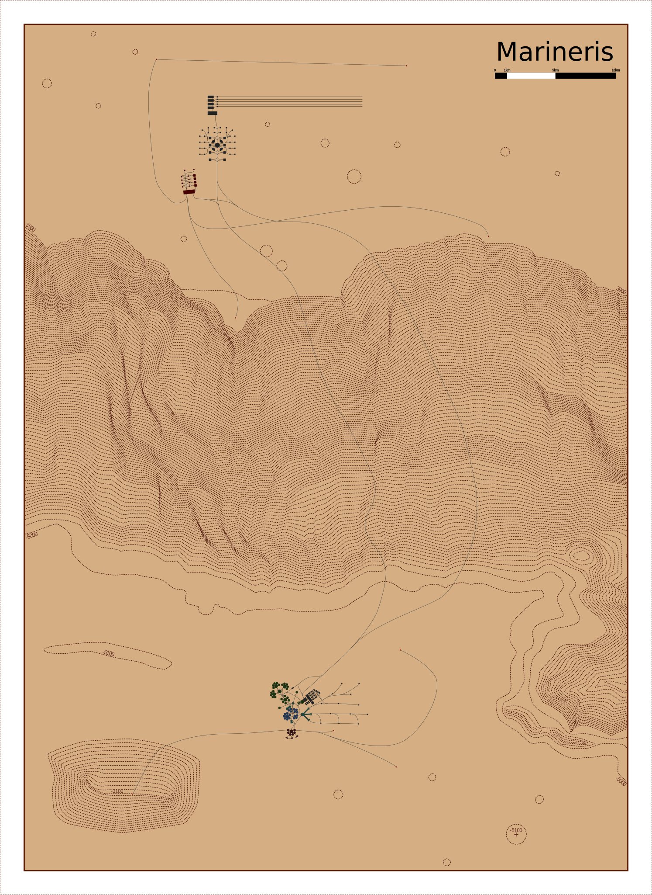

# Le point sur Solaires : 2019-03-22

Cette semaine est une petite semaine pour Solaires. J'ai principalement travaillé sur la campagne Marineris et les détails de l'épisode 2. De son côté Morvan a fait une première passe générale sur Émergence.

Quelques mots sur la carte de Marineris : il s'agit d'une carte à l'échelle 1/100 000 de la cité de Marineris et ses environs qui couvre une zone de 50 km par 70 km au niveau de Coprates Chasma. Trouver un fond de carte du coin est évidemment compliqué et je dois donc le refaire entièrement. Grace aux fonctions d'interpolation d'inkscape, les courbes de niveau ne sont pas aussi compliquées à fait que je l'imaginais, mais le résultat restera approximatif.

Je commence à avoir quelque chose de sympa, même s'il me reste encore beaucoup de travail à faire. Pour vous donner une idée voici un petit aperçu : 

Oui, c'est du vectoriel ! Je vous recommande au passage [Inkscape](https://www.inkscape.org) qui est un excellent logiciel de dessin vectoriel.

## Travaux de la semaine
Marineris :
* pas mal de progrès sur la carte de Marineris ;
* mise à plat d'une bonne partie du setting général (mais je ne peux évidemment rien dire à ce sujet sous peine de spoilers) ;
* préparation de l'épisode 2 (pareil, spoilers donc motus).

En dehors de ça, Morvan a fait « un peu » de relecture sur Émergence. Je ne le remercierais jamais assez !

## Les relectures de la semaine

Pour le moment la liste des textes à relire ne change pas. Il en reste donc beaucoup !

Si vous avez envie de participer à l'aventure, voici quelques textes qui mériteraient une relecture par d'autres que moi :
* [Émergence](https://docs.google.com/document/d/10dHvO2VacHHneT29BUMUvOUlS-t7jgMPzU9-dq-iOTs/edit?usp=sharing&authkey=CPvav5QJ) : il s'agit principalement d'une relecture de forme (le quatuor : bogue, syntaxe, orthographe et grammaire). **Effectuez les suggestions de correction directement sur le Google doc !**
* [États](https://github.com/Greewi/SolairesSources/blob/master/Encyclop%C3%A9die/1%20-%20Jouer%20%C3%A0%20Solaires/%C3%89tats.md) : avant de passer à une relecture de forme, un avis sur le fond pourrait être très intéressant.
* [Création de personnage](https://github.com/Greewi/SolairesSources/blob/master/Encyclop%C3%A9die/2%20-%20Les%20personnages/1%20-%20Cr%C3%A9ation%20de%20personnage.md)
* [Création guidée](https://github.com/Greewi/SolairesSources/blob/master/Encyclop%C3%A9die/2%20-%20Les%20personnages/2%20-%20Cr%C3%A9ation%20guid%C3%A9e.md)
* [Évolution](https://github.com/Greewi/SolairesSources/blob/master/Encyclop%C3%A9die/2%20-%20Les%20personnages/5%20-%20%C3%89volution.md)
* [Corps et esprit](https://github.com/Greewi/SolairesSources/blob/master/Encyclop%C3%A9die/1%20-%20Jouer%20%C3%A0%20Solaires/%C3%89lement%20sp%C3%A9cial%20-%20Corps%20et%20Esprit.md)

Pour effectuer ces relectures, je vous recommande la procédure décrite dans le document de contribution : https://github.com/Greewi/SolairesSources/blob/master/CONTRIBUTING.md. Si vous avez des questions, vous savez normalement où me contacter !

## Liens utiles

* Site de Solaires : https://solaires.feerie.net
* Solnet : https://solnet.feerie.net
* Trello de Solaires : https://trello.com/b/VWHyMF6M
* Sources des textes et articles : https://github.com/Greewi/SolairesSources
* Sources de l'application compagnon SolNet : https://github.com/Greewi/SolNet
* Sources des outils de développement : https://github.com/Greewi/SolnetConverter
