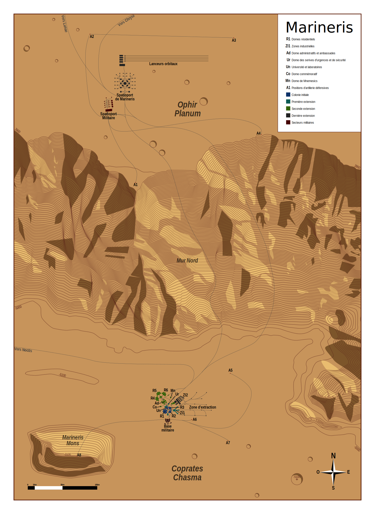
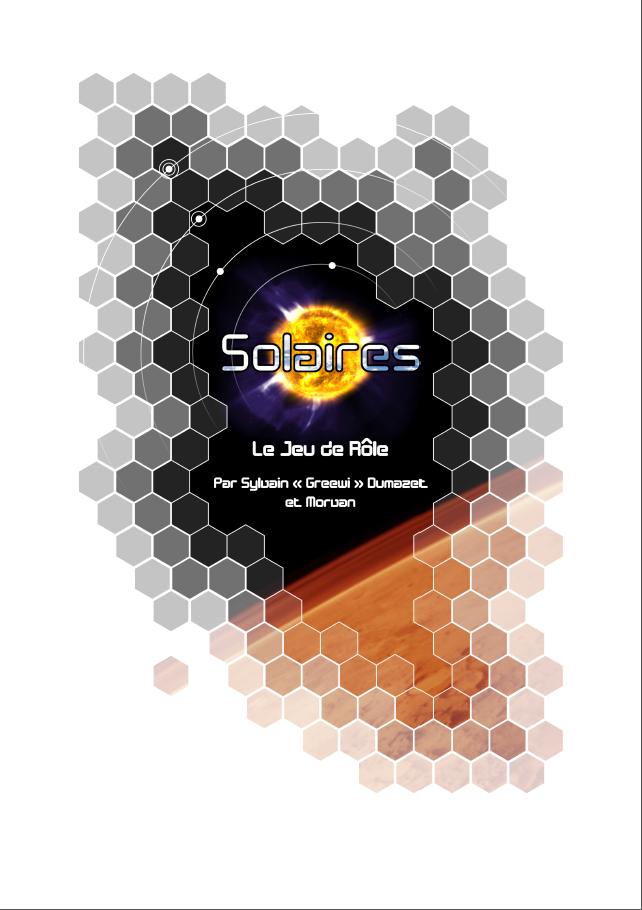
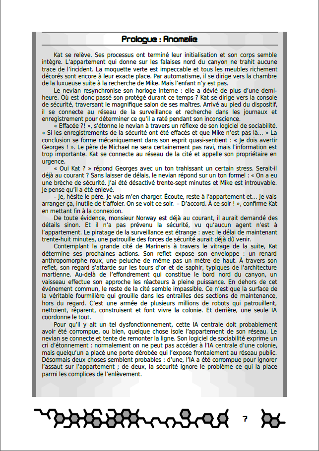
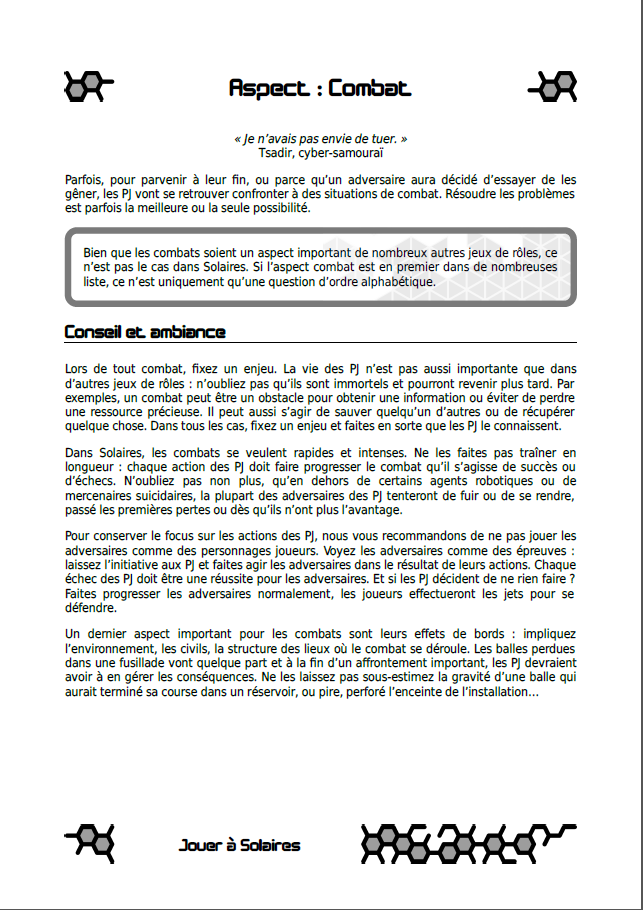

# Le point sur Solaires : 2019-03-29

Cette semaine, beaucoup de travail sur la carte de Marineris, qui est enfin terminée : réalisée avec [Inkscape](https://www.inkscape.org), elle couvre près de 3500 km². La cité de Marineris et ses dômes y sont visibles (et colorisées en fonction de leur ancienneté). On y trouve aussi les infrastructures militaires et le premier spatioport de Mars. Bah, oui, Marineris est la capitale de Mars !

Toujours sur un domaine graphique, je continue de peaufiner les styles et la mise en page du livre noyau. Voici quelques exemples de pages obtenues (attention c'est du Work In Progress) :

Par ailleurs, je continue d'avancer sur les outils de conversion et je complète lentement, mais surement, les textes qui manquent encore. Cette semaine c'est l'article sur l'Infiltration qui rejoint la collection.

## Travaux de la semaine
Marineris :
* finalisation de la carte de Marineris.

Outils :
* outil de conversion du format Markdown vers le format du Wiki.

SolNet :
* correction d'un bogue qui empêchait le bouton « Recharger » de fonctionner lorsqu'une nouvelle version était disponible.

Texte et livres :
* rédaction de l'article sur l'Infiltration ;
* affinage des styles pour le livre de base.

## Les relectures de la semaine

Pour le moment la liste des textes à relire ne change pas. Il en reste donc beaucoup !

Si vous avez envie de participer à l'aventure, voici quelques textes qui mériteraient une relecture par d'autres que moi :
* [Émergence](https://docs.google.com/document/d/10dHvO2VacHHneT29BUMUvOUlS-t7jgMPzU9-dq-iOTs/edit?usp=sharing&authkey=CPvav5QJ) : il s'agit principalement d'une relecture de forme (le quatuor : bogue, syntaxe, orthographe et grammaire). **Effectuez les suggestions de correction directement sur le Google doc !**
* [États](https://github.com/Greewi/SolairesSources/blob/master/Encyclop%C3%A9die/1%20-%20Jouer%20%C3%A0%20Solaires/%C3%89tats.md) : avant de passer à une relecture de forme, un avis sur le fond pourrait être très intéressant.
* [Création de personnage](https://github.com/Greewi/SolairesSources/blob/master/Encyclop%C3%A9die/2%20-%20Les%20personnages/1%20-%20Cr%C3%A9ation%20de%20personnage.md)
* [Création guidée](https://github.com/Greewi/SolairesSources/blob/master/Encyclop%C3%A9die/2%20-%20Les%20personnages/2%20-%20Cr%C3%A9ation%20guid%C3%A9e.md)
* [Évolution](https://github.com/Greewi/SolairesSources/blob/master/Encyclop%C3%A9die/2%20-%20Les%20personnages/5%20-%20%C3%89volution.md)
* [Corps et esprit](https://github.com/Greewi/SolairesSources/blob/master/Encyclop%C3%A9die/1%20-%20Jouer%20%C3%A0%20Solaires/%C3%89lement%20sp%C3%A9cial%20-%20Corps%20et%20Esprit.md)

Pour effectuer ces relectures, je vous recommande la procédure décrite dans le document de contribution : https://github.com/Greewi/SolairesSources/blob/master/CONTRIBUTING.md. Si vous avez des questions, vous savez normalement où me contacter !

## Liens utiles

Général :
* Site de Solaires : https://solaires.feerie.net
* SolNet : https://solnet.feerie.net
* Trello de Solaires : https://trello.com/b/VWHyMF6M

Textes et articles :
* Trello : https://trello.com/b/VWHyMF6M/solaires-textes-et-articles
* Sources : https://github.com/Greewi/SolairesSources

SolNet :
* Application : https://solnet.feerie.net
* Trello : https://trello.com/b/xTp8Mobo/solaires-solnet
* Sources : https://github.com/Greewi/SolNet

Outils :
* Trello : https://trello.com/b/wnaY1rNs/solaires-outils
* Sources : https://github.com/Greewi/SolnetConverter
