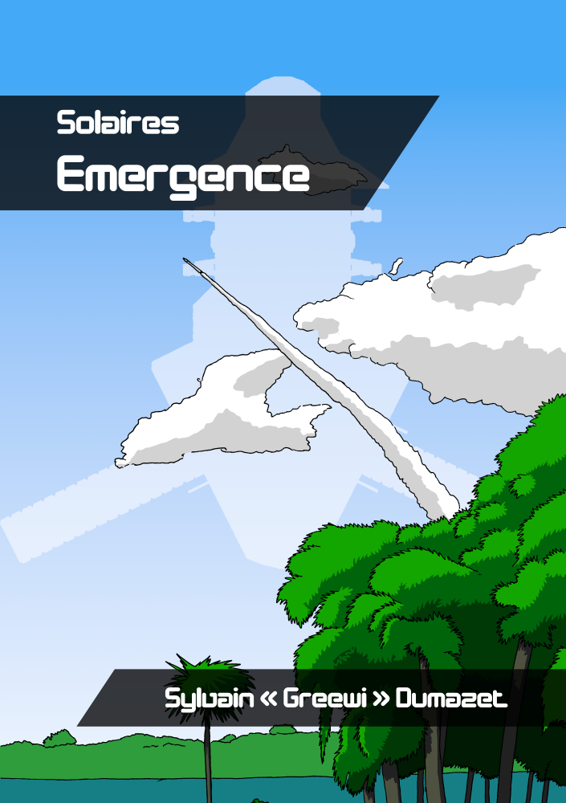

# Le point sur Solaires : 2019-05-11

Cette semaine, beaucoup de travaux en arrière-plan sur le Système Féerie. Pour autant, pas grand-chose à montrer et il reste encore beaucoup à abattre. Toutefois quelques simplifications sont à venir comme la gestion des points de personnage. Des précisions, notamment sur les valeurs des éléments, ou sur les conséquences des actions.

Sur un autre ordre d'idée, j'ai aussi travaillé sur la couverture d'Émergence, dont voici un aperçu : 

Enfin, j'ai effectué quelques essais pour une version utilisant la police Open Dyslexic 3 (https://opendyslexic.org/) du livre noyau destiné à celles et ceux qui souffrent de dyslexie. Si vous avez d'autres idées ou conseils pour une version plus accessible du livre de base, n'hésitez pas à nous en faire part !

## Travaux de la semaine

Illustrations :
* Couverture du roman *Émergence*.

Système Féerie :
* De nombreux travaux de simplification, précision, correction et amélioration.

Mise en page :
* Essaies d'une version accessible, notamment pour les personnes dyslexiques.

## Liens utiles

Général :
* Site de Solaires : https://solaires.feerie.net
* Open Solars : https://opensolars.feerie.net
* SolNet : https://solnet.feerie.net
* Trello de Solaires : https://trello.com/b/VWHyMF6M

Textes et articles :
* Trello : https://trello.com/b/VWHyMF6M/solaires-textes-et-articles
* Sources : https://github.com/Greewi/SolairesSources

SolNet :
* Application : https://solnet.feerie.net
* Trello : https://trello.com/b/xTp8Mobo/solaires-solnet
* Sources : https://github.com/Greewi/SolNet

Outils :
* Trello : https://trello.com/b/wnaY1rNs/solaires-outils
* Sources : https://github.com/Greewi/SolnetConverter
