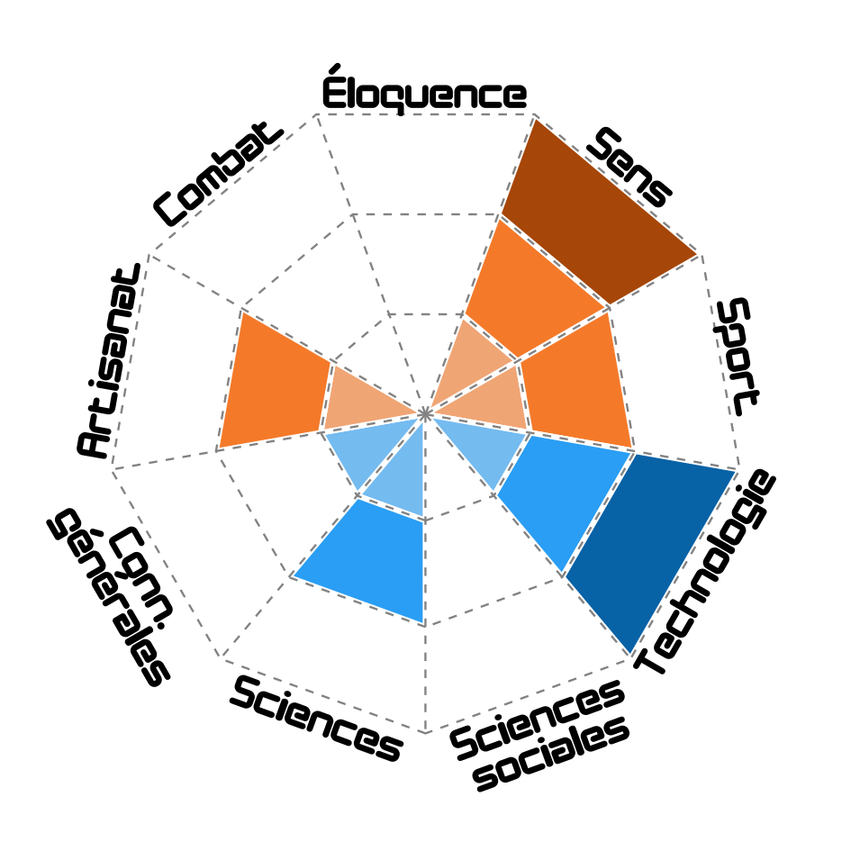

# Le point sur Solaires : 2019-05-28 - Retours sur Ludicité

La semaine passée, je me suis concentré sur la préparation pour *Ludicité* (http://ludicite.lamad.net/), un festival de jeux qui s'est déroulé samedi dernier (le 25 mai) au *Landy Sauvage*, organisé par *la Mare aux Diables* (http://lamad.net/).

Si je ne suis pas parvenu à faire jouer durant l'après midi, j'ai pu prendre divers contacts et présenter le jeu à plusieurs personnes très enthousiastes. J'ai aussi eu quelques retours intéressants sur la présentation de mes fiches de personnages, notamment pour les pré-tirés. La nocturne de son côté m'aura permis de faire la plus longue partie que j'ai pu faire ces dernières années (Sur le scénario *Nevians*). Nous commençâmes entre 21h et 22h pour finir sur les coups de 7h30. Je pense ne pas trop m'avancer en indiquant que les joueurs ont apprécié la partie !

Avec les préparatifs et la fatigues qui ont suivi l'évènement (et une charge de travail plutôt élevée en ce moment), ce présent billet a pris beaucoup de retard. Mais toute cette charge de travail aura quand même « quelques » retombées directes pour Solaires.

Pour commencer, les travaux sur les règles ont eu un petit coup de fouet et plusieurs ajustements et simplifications ont émergé :
* Les attitudes, plus contraignantes et source de confusion qu'autre chose, disparaissent : les éventuels effets secondaires sont décidés lors de la définition de l'action en collaboration avec le joueur.
* Les gains de points de personnages ont été remaniés : les joueurs en possèdent chacun trois au début de la partie et ne peuvent plus en regagner.
* Les modifications scénaristiques mineurs sont gratuites et toutes les majeures coûtent un point de personnage.
* Les modifications purement mécaniques, comme les relances de dés, ont été supprimées car elles n'apportaient rien à la narration.
* Les éléments ont désormais un niveau 0 pour les éléments sans importance. Par exemple, le matériel standard ou ordinaire ne fourni plus de bonus.
* Les échelles des éléments ont été revues et vous trouverez des descriptions plus claires pour mieux les estimer dans le chapitre : *Personnages*. D'ailleurs, les relations et le matériel ont été un peu « nerf » au passage, surtout les seconds qui perdent globalement un niveau.
* Les éléments avec un score de 1 ayant retrouvé leur valeur, leur obtention n'est plus gratuite (y compris via les points de personnage) et les règles des intrigues de personnage ont été modifiées en ce sens.

Je réfléchis encore à comment régler le problème des handicaps. La nature particulière du Système Féerie fait que le meneur ne peux pas connaître par cœur les fiches de personnage des joueurs. Il me faut encore faire des tests et j'ai très clairement raté une opportunité pour faire des tests là-dessus à *Ludicité*.

Toujours à propos des règles, nous sommes en train de mettre à jour la liste des carrières communes avec des indications plus claires sur les compétences qu'on peut en attendre. Voici un exemple du diagramme de compétence pour le Récupérateur spatial :

J'ai commencé une refonte de la fiche de personnage pour prendre en compte ces modifications : 

Pour finir sur les avancées permise par le rush *Ludicité*, j'ai un nouveau scénario, ses prétirés et sa carte. Avec une illustration ou deux en plus, je pense que je pourrais aisément le mettre en ligne ! L'équipe des personnages est une équipe des *Forces de sécurité de Mars* (et je ne sais pas pourquoi mais j'ai un faible pour WayUp).

## Liens utiles

Général :
* Site de Solaires : https://solaires.feerie.net
* Open Solars : https://opensolars.feerie.net
* SolNet : https://solnet.feerie.net
* Trello de Solaires : https://trello.com/b/VWHyMF6M

Textes et articles :
* Trello : https://trello.com/b/VWHyMF6M/solaires-textes-et-articles
* Sources : https://github.com/Greewi/SolairesSources

SolNet :
* Application : https://solnet.feerie.net
* Trello : https://trello.com/b/xTp8Mobo/solaires-solnet
* Sources : https://github.com/Greewi/SolNet

Outils :
* Trello : https://trello.com/b/wnaY1rNs/solaires-outils
* Sources : https://github.com/Greewi/SolnetConverter
