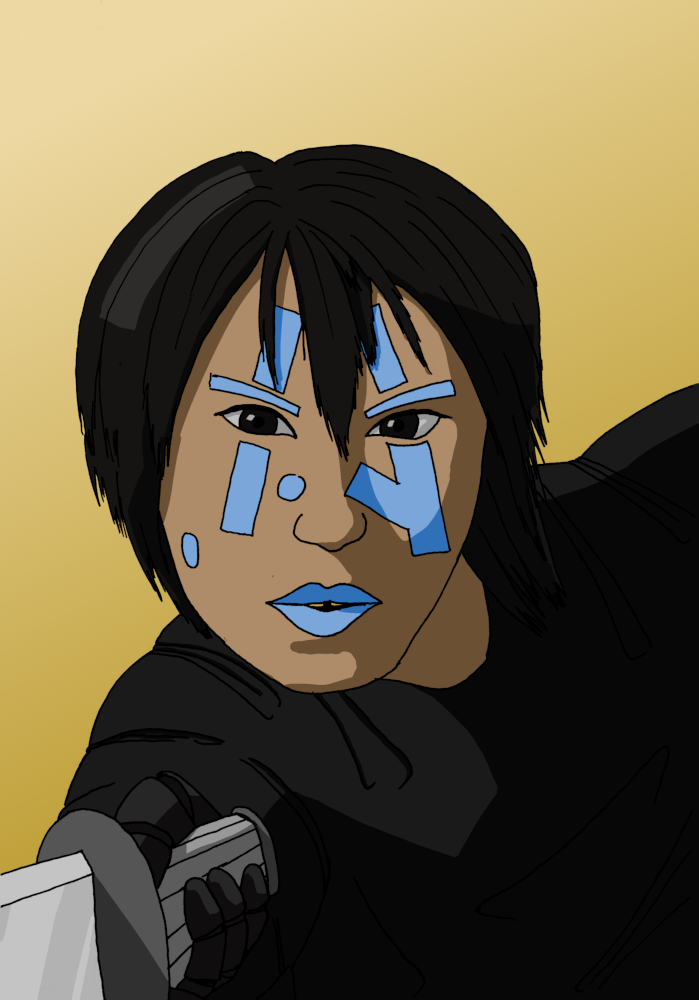

# Le point sur Solaires : 2019-06-14

Cette semaine, il est question de ninjas et de furries... Bon en vrai, ce n'est sans doute pas aussi excitant que ça.

Comme vous l'aurez sans doute remarqué la semaine dernière, j'ai du mal à tenir le rythme d'un billet par semaine. D'une part ma charge de travail professionnelle s'est temporairement alourdie [1], et de l'autre je suis dans une période où mes travaux sur Solaires prennent bien plus qu'une semaine pour être réalisés. Par conséquent, je vais un peu ralentir un peu le rythme de ces billets et n'en faire qu'un seul toute les deux semaines. Cela permettra, je l'espère, de produire des notes plus riches et d'avoir des choses plus concrète à présenter.

Reprenons avec ce qui vous intéresse et parlons ninjas. Pour le scénario *Poussières de Mars*, j'ai constitué une équipe de pré-tirés. Il s'agit d'une équipe des *Forces de sécurité de Mars*, la police, les pompiers et les sauveteurs martiens. Ce coup, plutôt que de proposer des personnages sans lien direct mais typique pour l'univers, j'ai créé une équipe cohérente et malgré tout typique. Comme j'ai quelques projets pour cette équipe, j'ai commencé à illustrer tous ces personnages.

Et voici donc E-Ward, la cyber-samouraï de l'équipe :

Et les furries me direz-vous ? En vrai, je n'y fais qu'une courte allusion dans le tout dernier article de fonds pour les personnages : [Les enveloppes](https://github.com/Greewi/SolairesSources/blob/master/Encyclop%C3%A9die/2%20-%20Les%20personnages/Enveloppes.md). Vous y trouverez une description plus détaillée que ce qui était disponibles des différents types d'enveloppes.

En plus de tout ça, ces deux dernières semaines, j'ai continué mon travail sur les règles et textes de Solaires : 
* relecture sur plusieurs articles ;
* précisions sur les exemples de l'article sur la résolution d'action ;
* mise au propre d'une version test du système des états.

J'ai donc un peu avancé sur le scénario *Poussières de Mars* :
* prise en compte des retours de Morvan sur son test ;
* début de l'illustration des prétirés (ils sont tous encrés, ne manque que la couleur) ;
* illustration d'un rover martien avec un châssis rocker (pareil : encre posée, couleur en approche).

Dans les travaux futurs, en plus de continuer les points précédents, je songe à retravailler la fiche de personnage car elle ne me plaît pas en l'état (notamment, beaucoup de place qui reste vide parce que j'ai sérieusement sur-estimé ce qui était nécessaire). Je compte aussi améliorer la définition des livres pour mieux les générés via les outils de SolnetConverter, notamment pour régénérer les articles de SolNet même.

Je relance au passage les invitations pour la campagne ouverte Marineris. Il s'agit d'une campagne de Solaires qui se déroule dans la capitale de Mars, Marineris. Le format ouvert ne vous engage à rien : vous pouvez faire une séance comme toutes les séances [3] et arriver en cours de route [4] ne posera aucun problème. Si vous êtes intéressés, rendez-vous sur [ce document](https://docs.google.com/document/d/1vnsapenEDSqdpRJRKmXiES6kOI89jvOOFIkjPeHsg5M/edit?usp=sharing) qui vous présentera les choses plus clairement.

À dans deux semaines !

Notes :
* [1] Je suis développeur web et nous avons une deadline importante. La situation reviendra normale fin juillet.
* [2] Autrement dit : « ne nous oubliez pas ! » -- Idle
* [3] En vrai, vous aurez du mal à jouer aux séances qui ont déjà eu lieu, mais j'implore votre clémence sur cette approximation bénigne.
* [4] En cours de route de la campagne, si vous vous pointez au milieu d'une séance ce sera plus compliqué pour le coup.

## Liens utiles

Général :
* Site de Solaires : https://solaires.feerie.net
* Discord : https://discord.gg/hWmsVkc
* Open Solars : https://opensolars.feerie.net
* SolNet : https://solnet.feerie.net
* Trello de Solaires : https://trello.com/b/VWHyMF6M

Textes et articles :
* Trello : https://trello.com/b/VWHyMF6M/solaires-textes-et-articles
* Sources : https://github.com/Greewi/SolairesSources

SolNet :
* Application : https://solnet.feerie.net
* Trello : https://trello.com/b/xTp8Mobo/solaires-solnet
* Sources : https://github.com/Greewi/SolNet

Outils :
* Trello : https://trello.com/b/wnaY1rNs/solaires-outils
* Sources : https://github.com/Greewi/SolnetConverter
