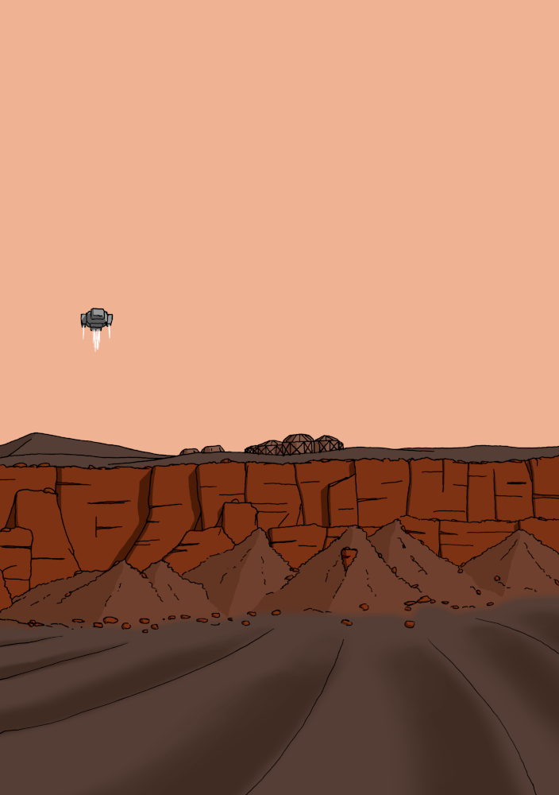
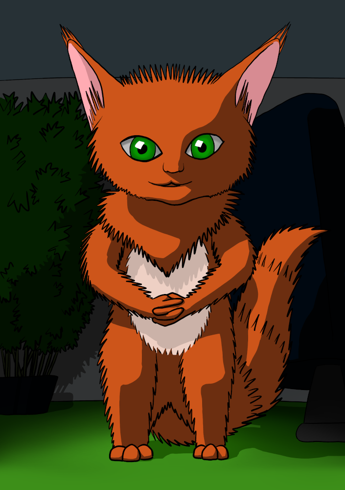

# Le point sur Solaires : 2019-08-11 - Poussières de Mars et SolNet

Voici des nouvelles de ces deux dernières semaines. L'écriture, les relectures et la mise en page du scénario Poussières de Mars sont terminés. C'est donc l'heure de mettre en ligne ce scénario d'introduction. Sur un autre front, j'ai effectué pas mal de travaux graphiques sur SolNet et retravaillé la navigation dans l'application. J'ai aussi commencé à travailler sur une couverture pour la nouvelle Virgile qui n'a toujours pas eu le droit à une publication en bonne et due forme.

Commençons par la pièce maîtresse de ces travaux. Poussières de Mars est un scénario d'introduction à Solaires. Il est proposé avec les pré-tirés que vous connaissez-déjà : l'équipe des Forces de sécurités de Mars, composée de Shard, WayUp, Daelink, Oliver Sand et E-Ward. Ce scénario est simple et court̂, normalement jouable en deux heures. Ce sera sans doute le scénario utilisé pour un futur kit de découverte de Solaires. N'hésitez donc pas à faire tous les retours que vous jugerez utiles.

Le scénario est disponible sur le site de solaires : [https://go.feerie.net/scenarios#poussieres_de_mars](https://go.feerie.net/scenarios#poussieres_de_mars)

> Poussières de Mars : *Un groupe de touristes parti visiter une installation martienne isolée ne donne plus de signe de vie. Les forces de sécurité de Mars envoient une équipe pour les retrouver et les ramener sains et saufs dans les colonies.*
> 
> 

Passons sur SolNet. J'ai effectué une grande passe graphique pour donner à l'interface une finition plus professionnelle. En plus de ce redesign purement graphique, j'ai ajouté un panneau latéral contenant le sommaire et le fil d'Ariane. C'est dans ce même panneau que les notifications de mise à jour et d'installation sont rangées pour ne plus gêner la lecture. Les boutons du pied de page ont aussi été détachés pour augmenter la surface affichée. Les prochains travaux vous permettrons de lire les articles tout en conservant un accès rapide (en au plus un bouton) à votre personnage, histoire de rendre SolNet plus pratique à utiliser lors d'une partie. Les fiches de personnages internes seront aussi retravaillées, les versions actuelles étant très basique et peu ergonomique.

Solnet : [https://solnet.feerie.net](https://solnet.feerie.net)

Enfin, la nouvelle Virgile, qui sert d'introduction à la campagne Marineris, n'est pas encore vraiment publiée (elle est disponible sur Atramenta et c'est tout). J'ai commencé à travailler sur une couverture pour permettre de la publier prochainement sur le site de Solaires et les sites de publication habituel (Atramenta, Scribay et Wattpad).

Pour les curieux, voici Kat :

## Liens utiles

Général :
* Site de Solaires : https://solaires.feerie.net
* Discord : https://discord.gg/hWmsVkc
* Open Solars : https://opensolars.feerie.net
* SolNet : https://solnet.feerie.net
* Trello de Solaires : https://trello.com/b/VWHyMF6M

Textes et articles :
* Trello : https://trello.com/b/VWHyMF6M/solaires-textes-et-articles
* Sources : https://github.com/Greewi/SolairesSources

SolNet :
* Application : https://solnet.feerie.net
* Trello : https://trello.com/b/xTp8Mobo/solaires-solnet
* Sources : https://github.com/Greewi/SolNet

Outils :
* Trello : https://trello.com/b/wnaY1rNs/solaires-outils
* Sources : https://github.com/Greewi/SolnetConverter
