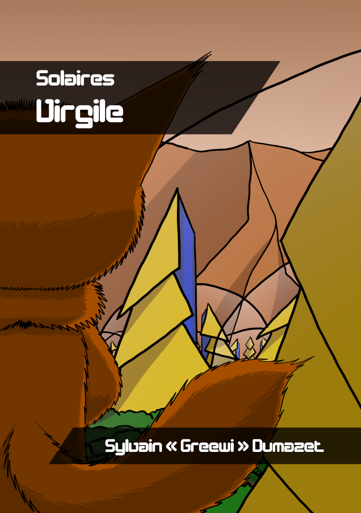

# Le point sur Solaires : 2019-09-06 - Nouvelles de nouvelles

Voici les nouvelles du dernier mois et oui, j'étais bien trop occupé pour faire le billet d'il y a deux semaines. Mais du coup, de quoi allons-nous parler aujourd'hui ? En résumé, des tas de corrections sur les récits, des tas. Un grand merci à Morvan dont les yeux doivent encore peiner à se remettre des horreurs issues de ma plume… enfin, mon clavier.

## Des nouvelles nettoyées

Mais de quoi parle-t-on exactement ? De tous les récits. TOUS, que ce soit la plus ancienne des nouvelles publiées à la plus récente, sans oublier les romans. Et histoire de ne pas faire les choses qu'à moitié, les PDF et ebook ont aussi été régénérés pour l'occasion avec mon nouveau système.

Vous trouverez tous les récits dans la section du site qui leur correspond : [https://solaires.feerie.net/dokuwiki/doku.php?id=media:recits](https://solaires.feerie.net/dokuwiki/doku.php?id=media:recits). Si les sources en Markdown vous intéressent (et c'est en Creative Common BY-NC-SA), vous les trouverez là : [https://github.com/Greewi/SolairesSources/tree/master/R%C3%A9cits](https://github.com/Greewi/SolairesSources/tree/master/R%C3%A9cits).

Notez que si la version sur le site de Solaires est parfaitement à jour, celle sur les sites externes (Atramenta, Scribay et Wattpad) ne le sont pas. Passer plusieurs jours à faire des copier/coller ne m'enjoue pas et je pense avoir bien mieux à faire. Les seules nouvelles sur Atramenta m'ont déjà pris bien du temps et c'est sans doute le site sur lequel mettre à jour un livre entier est le plus rapide.

## Publication de Virgile

Mais ce n'est pas tout ! La nouvelle Virgile est enfin publiée ! Vous la trouverez sur le site de Solaires et sur le trio Atramenta, Scribay et Wattpad : 
* [https://solaires.feerie.net/dokuwiki/doku.php?id=media:recits](Sur Feerie Network)
* [https://www.atramenta.net/lire/solaires--virgile/73088](Sur Atramenta)
* [https://www.scribay.com/text/975538207/solaires---virgile](Sur Scribay)
* [https://www.wattpad.com/myworks/199741207-solaires-virgile](Sur Wattpad)

*2093, Marineris, capitale de Mars. L'enlèvement du fils d'un diplomate en visite sur Mars conduit un assistant domestique à recruter indirectement une équipe indépendante pour régler sa situation. Ne soyez pas surpris : après tout, si une IA est mise face à un problème, n'est-elle pas amenée à le résoudre ?*

Écrite en août 2018, cette nouvelle sert d'introduction à l'univers de Solaires, présentant le contexte des colonies et engageant une petite équipe indépendante typique dans une affaire moins habituelle.

Écrite dans le but de servir de texte d'ambiance pour le jeu de rôles, Solaires, il s'agit aussi de l'introduction de la campagne Marineris pour ce même jeu. Chronologiquement, cette histoire se déroule avant le roman Émergence, mais les liens entre les deux n'imposent aucun ordre de lecture particulier.

## À propos de l'ordre de ces récits

Les récits de Solaires ne se suivent directement et si des personnages passent de l'un à l'autre, il est possible de les lire dans n'importe quel ordre. Pour autant, certains préféreront les lires dans l'ordre chronologique, d'autres dans l'ordre de lecture. Pour vous aider voici quelques infos.

Ordre chronologique (date approximative dans l'univers) :
* Nevi (novembre 2077) ;
* Idle (septembre-octobre 2091) ;
* Le puits interdit (février 2093) ;
* Virgile (avril 2093) ;
* Émergence (principalement août 2093) ;
* Nouveaux dieux (février 2094).

Ordre d'écriture (date d'écriture) :
* Le puits interdit (novembre 2014) ;
* Nevi (décembre 2015) ;
* Idle (mai 2017) ;
* Nouveaux dieux (novembre 2017) ;
* Virgile (août 2018) ;
* Émergence (novembre 2018).

Dans quel ordre, j'en conseille la lecture ? Je proposerais de commencer par Virgile puis de suivre l'ordre chronologique.

Note : pour ceux qui se poseraient la question, l'ébauche de bande dessiné, Eve 3c, est intégrée dans le récit de Nouveaux Dieux.

## Travaux sur SolNet

J'ai aussi beaucoup travaillé sur SolNet. Désormais vous pouvez épingler un personnage qui sera accessible en une pression sur la petite icône qui apparaît en haut à droite de l'application. Si vous cliquer dessus, vous ouvrirez un panneau latéral avec toutes les informations de votre personnage, et ce sans vous perdre la page que vous étiez en train de lire. Pratique pendant la partie !

## Et Solaires ?

Enfin, j'ai beaucoup avancé sur Solaires et la version beta 5.3 s'approche suffisamment pour devenir presque tangible. Les derniers travaux se sont focalisé sur les parties Jouer à Solaires et Les personnages. Pour le moment, tout ceci n'est encore que sur GitHub.

Ce sera tout pour cette fois, et je vous souhaite une bonne lecture !

## Liens utiles

Général :
* Site de Solaires : https://solaires.feerie.net
* Discord : https://discord.gg/hWmsVkc
* Open Solars : https://opensolars.feerie.net
* SolNet : https://solnet.feerie.net
* Trello de Solaires : https://trello.com/b/VWHyMF6M

Textes et articles :
* Trello : https://trello.com/b/VWHyMF6M/solaires-textes-et-articles
* Sources : https://github.com/Greewi/SolairesSources

SolNet :
* Application : https://solnet.feerie.net
* Trello : https://trello.com/b/xTp8Mobo/solaires-solnet
* Sources : https://github.com/Greewi/SolNet

Outils :
* Trello : https://trello.com/b/wnaY1rNs/solaires-outils
* Sources : https://github.com/Greewi/SolnetConverter
