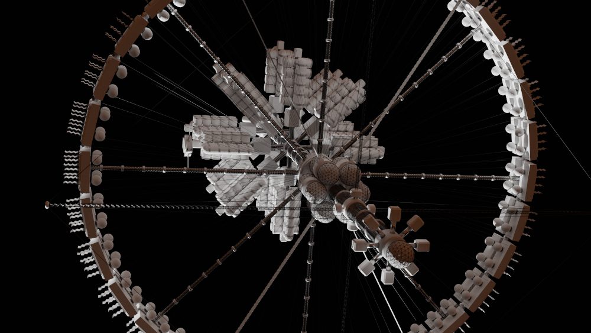

# Le point sur Solaires : 2019-09-27

Voici les nouvelles de ces dernières semaines. Je peine à garder le rythme de ces billets, mais je ne vous oublie pas !

Ces derniers temps, j’ai principalement travaillé sur une aide de jeu promise pour l’e-zine Rôle&Roll. J’ai aussi pas mal réfléchi à l’organisation du livre noyau de Solaires qu’il faudra bien sortir un jour [1]. J’ai « perdu » pas mal de temps sur une idée de jeu de société coop à base de nevians, mais soyons lucides, peu de chance que ça donne quelque chose [2].

## Une station spatiale ?

L’aide de jeu pour l’e-zine Rôle&Roll est une description d’une station de transit type. Ces stations peuvent pratiquement être l’équivalent des tavernes des univers medfan, dans le sens ou ce sont de formidables lieux de rencontres où pratiquement tous les solaires qui voyagent passent. Je ne développerais pas plus le contenu ici (sinon quel serait l’intérêt de cette aide de jeu). Ce que je peux en revanche vous montrer ce sont mes bidouilles avec blender pour essayer d’illustrer cette fameuse station.

Vous pouvez retrouver Rôle&Roll à cette adresse : http://role-roll.clicforum.com/index.php

## Organisation du livre noyau de Solaires

Pour Solaires, j’aimerais bien sortir la version bêta 5.3 avant la fin de l’année. L’organisation du livre noyau m’a posé de nombreux problèmes ces derniers temps et j’ai très probablement passé bien plus de temps que nécessaire sur les « aspects du jeu » cette année passée.

Pour commencer, chose assez mineure, je vais changer un peu la nomenclature : le livre noyaux sera constitué de livres et les livres de chapitres. Ce sera plus clair, surtout que vu la taille du manuel en l’état actuel des choses (plus de 300 pages sans aucune illustration…), je ferais une version ou ces livres seront séparés.

Ainsi, Solaires sera constitué des livres suivants :
* *Jouer à Solaires*, qui contient les règles nécessaires pour jouer ;
* *Personnages*, apportant les règles de création des personnages ;
* *Le contexte*, contenant les informations globales sur l’univers de Solaires ;
* *Vies de solaires*, décrivant les nombreux aspects de la vie dans les colonies ;
* *Le Catalogue*, listant et décrivant le matériel, outils et autres éléments de l’univers.

Enfin, je vais remettre le focus des différents livres sur leur sujet précis et dégager les chapitres qui n’ont rien à y faire. Ainsi, les chapitres comme *Corps et esprit* ou *Psions*, ne seront plus dans *Jouer à Solaires*, mais déplacés dans *Vies de solaires*. D’autres chapitres seront aussi créés comme *Guerre* ou encore *La matrice et les infomorphes*. Les chapitres *Intelligences*, *Enveloppes*, *Carrières* rejoindront les autres listes d’articles dans le livre *Le catalogue*.

## Nevians ? Nevians ? Neviaaaaaaaaaaaaaaaaaaaaaaannnnnnnnnnnn !

Bon, parfois mon esprit s’emballe et de temps en temps il me vient une idée qui me travaille assez pour m’empêcher de dormir. Dans ce genre de situation, il vaut mieux tout noter histoire de décharger le processeur et pouvoir trouver le sommeil.

Là, c’était une idée de jeu de société où des Nevians se réveillent à une époque inconnue mais où le monde pour lequel ils avaient été conçus n’existe plus. Un monde dominé par « la Machine », profondément hostile (et abstraite), luttant contre d’autres nuisances comme une peste de nanomachines autoréplicantes ou des insectoïdes envahissants.

Le jeu serait un jeu coopératif d’exploration, de récupération et de survie. Les joueurs se partageraient un certain nombre de nevians et évolueraient sur une carte construite au fil du jeu et du tirage des cartes. C’est assez ambitieux pour que ce projet ne voit pas le jour, mais si vous vous demandez pourquoi je n’ai pas autant avancé ces dernières semaines, vous savez ce que mon cerveau m’inflige parfois.

Notez que ce n’est pas complètement contre-productif puisque que ça m’a donné quelques idées pour le futur lointain de Solaires, une époque où les solaires eux-mêmes ont disparus et où ce qu’ils ont laissé dernière eux se réveille dans l’après civilisation.

Rassurez-vous, le prochain NaNoWriMo traitera de choses que vous connaissez mieux !

## La suite ?

Les prochaines semaines, je vais essayer de travailler sur la Beta 5.3, j’ai plusieurs axes possibles, entre les textes, l’organisation et les illustrations. Il est aussi possible que d’autres modélisations et rendus fassent leur arrivée, car j’ai pris pas mal de plaisir à jouer avec Blender [3]. Qui sait ? Ne me regardez pas comme ça, j’en sais pas plus que vous !

Il y aura bien sûr d’autres travaux pour l’aide de jeu. Notamment des plans. Sans compte qu’il faudra retravailler le texte.

* [1] Ça fait plus d’un an que la Beta 5.3 est dans les tuyaux…
* [2] Ça m’a bien amusé par contre.
* [3] Oui, c’est avec Blender (https://www.blender.org/) que j’ai fait ces images. La dernière version, la 2.8, est une vraie petite merveille.

## Liens utiles

Général :
* Site de Solaires : https://solaires.feerie.net
* Discord : https://discord.gg/hWmsVkc
* Open Solars : https://opensolars.feerie.net
* SolNet : https://solnet.feerie.net
* Trello de Solaires : https://trello.com/b/VWHyMF6M

Textes et articles :
* Trello : https://trello.com/b/VWHyMF6M/solaires-textes-et-articles
* Sources : https://github.com/Greewi/SolairesSources

SolNet :
* Application : https://solnet.feerie.net
* Trello : https://trello.com/b/xTp8Mobo/solaires-solnet
* Sources : https://github.com/Greewi/SolNet

Outils :
* Trello : https://trello.com/b/wnaY1rNs/solaires-outils
* Sources : https://github.com/Greewi/SolnetConverter