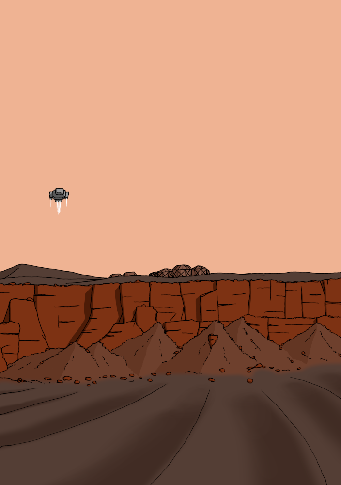

# Le point sur Solaires : 2020-01-03 – Farewell 2019

C’est une nouvelle année, et donc la fin de la précédente. 2019 a été une année assez riche pour *Solaires*, même si elle n’a pas vu la publication du livre noyau de *Solaires*.

Avant de faire le point sur l’avancée en décembre et de faire une rétrospective de l’année dernière, je vous souhaite à tous une bonne année et une bonne santé. Puisse cette année vous être favorable.

## Système Féerie

En décembre, en plus de faire une première relecture de *Les invisibles*, mon NaNoWriMo 2019, j’ai extrait le *Système Féerie* et fait un premier jet du système. Il reste évidemment encore quelques éléments à ajuster, mais dans l’ensemble le système est plutôt stable. Quelques nouveautés font leur apparition et seront réintégré dans *Solaires*, notamment de nouveaux exemples de modifications scénaristiques.

Pour ceux qui ne connaissent pas le *Système Féerie*, il s’agit d’un système léger qui met la description et la narration au centre du jeu. Ses points forts sont sa simplicité, sa grande adaptabilité et la liberté qu’il offre aux joueurs et meneur sur l’histoire et la création des personnages. En particulier, sa grande adaptabilité vous permet théoriquement de l’utiliser tel quel pour improviser une partie dans un univers particulier. Pour arriver à ses fins, ce système propose plusieurs changements inhabituels par rapport à la plupart des jeux. En particulier, la création de personnage est basée sur la description et l’évaluation et non sur des règles mécaniques de répartition ou de choix. Autre élément important, le système traite tous les types de situations de la même façon : il ne propose pas de règle dédiée au combat ou la magie, par exemple.

Vous trouverez tout ça sur son propre dépôt git (https://github.com/Greewi/SystemeFeerieSources) et vous pouvez aller y jeter un œil si ça vous intéresse. Le système est en *CC-BY-SA* donc n’hésitez pas à l’utiliser dans vos propres projets !

## Accessibilité

En écrivant cette version du *Système Féerie*, j’ai ajouté une section dans l’introduction qui devrait intéresser tout créateur : quelques remarques et conseils sur l’accessibilité. On y parle de problèmes de vue, de daltonisme, de surdité, de dyslexie, d’aphantasie, de trouble du déficit de l’attention et quelques autres. Pourquoi ? Le jeu de rôles est un medium très malléable et il serait dommage d’exclure involontairement des joueurs pour des choses qui être résolues assez simplement.

Pour plus d’information, voyez [la section de l’introduction qui en traite](https://github.com/Greewi/SystemeFeerieSources/blob/master/Système%20Féerie%20V5/0%20-%20Introduction.md#un-mot-sur-laccessibilité).

## 2019 – une rétrospective de l’année passée

2019 aura donc été une année dense pour *Solaires* et le *Système Féerie*.

Lancement du projet *Open Solars* :
* Solaires est désormais un véritable projet open source ;
* Avec les textes sources au format markdown ;
* Avec les outils de génération des ebook et pdf ;
* Avec les sources de SolNet.

Plusieurs nouveaux articles pour *Solaires* ont ainsi vu le jour :
* [*Psions*](https://github.com/Greewi/SolairesSources/blob/master/Encyclop%C3%A9die/4%20-%20Vies%20de%20solaires/Psions.md) ;
* [*Corps et esprit*](https://github.com/Greewi/SolairesSources/blob/master/Encyclop%C3%A9die/4%20-%20Vies%20de%20solaires/Corps%20et%20Esprit.md) ;
* [*Intelligences*](https://github.com/Greewi/SolairesSources/blob/master/Encyclop%C3%A9die/5%20-%20Le%20catalogue/14%20-%20Intelligences.md) ;
* [*Enveloppes*](https://github.com/Greewi/SolairesSources/blob/master/Encyclop%C3%A9die/5%20-%20Le%20catalogue/13%20-%20Enveloppes.md) ;
* [*Matrice et infomorphes*](https://github.com/Greewi/SolairesSources/blob/master/Encyclop%C3%A9die/4%20-%20Vies%20de%20solaires/Matrice%20et%20infomorphes.md) ;
* [*Environnements spatiaux*](https://github.com/Greewi/SolairesSources/blob/master/Encyclop%C3%A9die/4%20-%20Vies%20de%20solaires/Environnements%20spatiaux.md).

De nouveau récits :
* Publication du roman *Émergence* ([lire sur le site](https://solaires.feerie.net/dokuwiki/doku.php?id=media:recits#emergence_roman)) ;
* Publication de la nouvelle *Virgile* ([lire sur le site](https://solaires.feerie.net/dokuwiki/doku.php?id=media:recits#virgile_nouvelle)) ;
* Écriture du NaNoWriMo 2019 : *Les invisibles* ([lire sur Atramenta](https://www.atramenta.net/lire/solaires--les-invisibles/78992), [lire sur Scribay](https://www.scribay.com/text/1079539929/solaires---les-invisibles--nanowrimo-2019-)).

Un nouveau scénario :
* Publication du scénario *Poussières de Mars* ([télécharger sur le site](https://solaires.feerie.net/dokuwiki/doku.php?id=telechargements:scenarios#poussieres_de_mars)).

Une nouvelle équipe de pré-tirés :
* L’*équipe des Forces de sécurité de Mars* ([télécharger sur le site](https://solaires.feerie.net/dokuwiki/doku.php?id=telechargements:personnages#equipe_des_forces_de_securite_de_mars)).

De nombreux travaux sur SolNet (https://solnet.feerie.net) :
* Création de la Progressive Web App ;
* Finalisation de la création de personnage ;
* Remise en forme et styles ;
* Amélioration de la navigation.

Le projet N (https://projetn.feerie.net) :
* Conçu pour réaliser la couverture du roman *Les invisibles* ;
* C’est un générateur de portrait de nevian. Oui.

Travaux divers :
* Lancement de la campagne *Marineris*
* Nouvelle mise en page de toutes les nouvelles et romans
* Nouvel outil de génération des fiches de personnages
* Setting pour Rôle&Roll (pas encore publié)

Et bien sûr, de nombreuses illustrations :

## 2020 – Vers la beta 5.3 ?

Une nouvelle année, mais toujours le même projet. Si le début de cette année devrait être principalement occupé par les relectures du dernier NaNoWriMo et la publication du nouveau Système Féerie V5, Solaires n’est plus très loin d’une version beta 5.3 pour son livre noyau. Mais comme cet objectif était déjà celui de 2019… bref.

Il y aura aussi d’autres scénarios : plusieurs attendent d’ailleurs une mise au propre depuis des années.

J’envisage aussi de créer une seconde équipe de pré-tirés (organisée autour d’un solar wardner) voir une troisième (l’équipage d’une petite corvette).

Et surtout, j’espère bien faire jouer. Et à ce sujet, la campagne Marineris recrute toujours ! Pour plus d’information sur cette campagne, lisez donc le [document de présentation](https://docs.google.com/document/d/1vnsapenEDSqdpRJRKmXiES6kOI89jvOOFIkjPeHsg5M/edit?authkey=CLGotbML) !

## Liens utiles

Général :
* Site de Solaires : https://solaires.feerie.net
* Discord : https://discord.gg/hWmsVkc
* Open Solars : https://opensolars.feerie.net
* SolNet : https://solnet.feerie.net
* Trello de Solaires : https://trello.com/b/VWHyMF6M

Textes et articles :
* Trello : https://trello.com/b/VWHyMF6M/solaires-textes-et-articles
* Sources : https://github.com/Greewi/SolairesSources
* Sources : https://github.com/Greewi/SolairesSources

SolNet :
* Application : https://solnet.feerie.net
* Trello : https://trello.com/b/xTp8Mobo/solaires-solnet
* Sources : https://github.com/Greewi/SolNet

Outils :
* Trello : https://trello.com/b/wnaY1rNs/solaires-outils
* Sources : https://github.com/Greewi/SolnetConverter