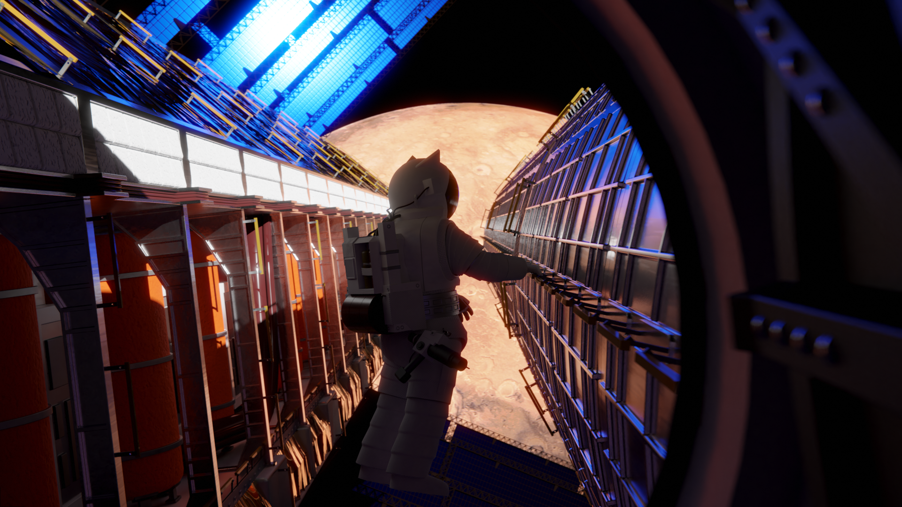

# Le point sur Solaires : 2020-03-18

Ce début d’année est sans doute l’un des plus atypiques et des terribles que j’ai pu connaître et avant de poursuivre sur l’état de *Solaires*, j’aimerais aborder la question du confinement et de tout ce que ça implique pour moi et mes projets. Tout d’abord, je sais ce confinement nécessaire (et, en vérité, il aurait sans doute été préférable qu’il commence plus tôt) et si vous aviez encore un doute : restez chez vous ! Prenez soin de vous et soyez patients. Je vous aime tous <3 .

Pour mes projets, c’est assez paradoxal. Je suis actuellement en télétravail depuis l’annonce du confinement, ce qui théoriquement devrait me donner plus de temps pour avancer sur *Solaires* vu que je n’ai plus de trajets à effectuer. Sauf que c’est précisément ce temps de trajet, avec le netbook sur les genoux dans le RER, qui me permettait de me détacher de toutes mes sources de distractions. Pire encore : maintenant, mon ordinateur de travail est aussi mon ordinateur de loisir. Si vous vous demandez pourquoi le mois de janvier avait été si calme (voir le billet précédent), c’était pour une raison similaire mais avec une cause différente : les grèves des transports. Je n’avais alors plus ce moment pour moi, détaché de toute source de procrastination.

Mais assez de mauvaises nouvelles et attaquons ce qui vous intéresse plus probablement : j’envisage une sixième version de l’univers de *Solaires*, j’ai pas mal avancé sur le Système Féerie, je cherche encore de l’aide pour les relectures de mon dernier roman, Les invisibles, et j’ai fait quelques expérimentations avec Blender.

# Vers Solaires 6.0 ?

Commençons avec ce qui pourrait être le plus gros changement pour *Solaires* de ces dernières années.

L’univers du jeu que vous connaissez est la cinquième version (d’où le « 5 » dans cette beta 5.3 qui n’est toujours pas arrivée). Avec le temps, s’il s’est considérablement étoffé, ses limites m’apparaissent de plus en plus flagrantes.

Commençons avec le point qui a déclenché la réflexion : notre monde continue son évolution et de nombreux événements ont modifié la vision qu’on pouvait avoir sur l’avenir. La chronologie de *Solaires* est sans doute trop rattachée à notre époque et plus le temps passe plus l’avenir proche semble incompatible avec ce qui est décrit pour *Solaires*. Si j’ai indiqué une crise énergétique, les crises à venir, notamment environnementales, vont considérablement changer la donne et sans verser dans le pessimiste rampant, notre façon de vivre risque fort d’en pâtir considérablement dans les décennies qui arrivent. Or dans l’histoire de *Solaires*, le monde semble à peine avoir ralenti. Je pense que la chronologie de la sixième version de *Solaires* commencera vers le milieu du 21e siècle alors que l’humanité se remet d’une crise sans précédent, nommé « l’effondrement ». Cela laissera plus de marge pour installer l’histoire de *Solaires*.

La chronologie avait un autre problème : ses échelles de temps était, vaguement, basées sur les prédictions des transhumanistes. Toutefois, si la progression de l’IA et des technologies peut effectivement avancer vite, ce n’est pas du tout le cas de l’exploration spatiale dont les programmes ont généralement un lag de dix ans. Il en ressort que la colonisation ne laissait que 30 ans entre les premières bases martiennes et l’époque de jeu avec plus de cinq millions d’habitants dans les colonies dont la majorité auraient dû s’extraire de la gravité de la Terre. Ah et la guerre des colonies qui a duré quatre ans est comprise dans l’intervalle. La sixième version devrait normalement doubler ce délais afin d’apporter quelque chose de plus crédible.

Autre soucis, les PJ manquaient de cadre et si le concept des indépendants était intéressant, leur mise en œuvre posait quelques soucis et il était généralement préférable de les associer à un faction en particulier (d’où l’équipe des forces de sécurité de Mars par exemple). Si une sixième version venait à apparaître, je pense que donner clairement une faction par défaut pour les PJ serait une bonne chose. En laissant bien sûr la possibilité de créer des personnages d’autres horizons. Ce serait, histoire de rester dans le thème, la nation solaire.

Les deux autres problèmes sont très liés : d’un côté l’humanité n’est pas assez présente dans l’univers du jeu. Certes, le jeu s’appelle *Solaires* et on y joue les enfants de l’humanité, mais si je souhaite explorer le thème du conflit générationnel et de la prise d’indépendance, il faut que ces parents soient présents. Sans compter que ce point de référence permet de donner plus de contraste aux solaires. L’autre pendant du problème : l’évolution des corporations en nation extra-terrestre bienveillantes pose un autre problème de crédibilité qui pourrait se résumer à : « Pourquoi les investisseurs les auraient laissées se barrer avec la caisse ? ». L’idée pour ces deux points serait simplement de leur redonner le rôle qu’elles avaient dans les versions précédentes : des super-sociétés privées guidée par leurs actionnaires. Et ceux qui composent et dirigent ces multinationales sont des représentants de cette humanité.

Ce sont les premières pistes pour avancer dans cette direction et si j’étudie la question, rien ne dit que ce sera effectivement fait. Je dois avouer que le principal élément qui me retient sont les récits. Au fil des années, j’ai quand même écrit pas moins de quatre romans et cette réinitialisation de l’univers les rendrait en très grande partie caduques.

Si vous avez un avis ou des conseils sur la question, n’hésitez pas à le dire !

## Progression du Système Féerie

Les travaux sur le *Système Féerie* ont beaucoup avancé et vous pouvez lire les textes en l’état sur [le dépôt GitHub](https://github.com/Greewi/SystemeFeerieSources). Les travaux récents portent sur les états et la progression des personnages. Les prochains viseront la création de personnage qui devrait renouer avec ses origines.

Le *Système Féerie*, en l’état, est parfaitement utilisable et fonctionnel. Si vous l’avez essayé, n’hésitez pas à nous donner vos avis et suggestions !

## Les invisibles

La relecture de mon roman, *Les invisibles*, a un peu avancé. Elle reste encore loin d’être terminée et c’est sans doute l’année ou je peine le plus sur cet aspect (ce qui est paradoxal, puisque son écriture s’est extrêmement bien déroulé). Le texte est toujours ouvert à la relecture et aux suggestions publiques sur [ce document](https://docs.google.com/document/d/1hTV0YVJPS7PlzAzBC2uy_k3q2F_L6uepsDACauFrjkY/edit?usp=sharing). Si vous voulez m’aider sur ce roman, ou si vous avez des conseils ou suggestion, c’est là que vous pourrez le faire.

## Un peu de 3D dans ce monde plat

Si j’ai déjà démontré plusieurs fois mon intérêt pour Blender, un logiciel de modelage et de rendu d’image 3D, je n’avais encore pas vraiment produit quelque chose de réellement ambitieux. Ces deux dernières semaines, j’ai passé beaucoup de temps dessus (probablement une bonne vingtaine d’heures) et voici le résultat :

## Liens utiles

Général :
* Site de Solaires : https://solaires.feerie.net
* Discord : https://discord.gg/hWmsVkc
* Open Solars : https://opensolars.feerie.net
* SolNet : https://solnet.feerie.net
* Trello de Solaires : https://trello.com/b/VWHyMF6M

Textes et articles :
* Trello : https://trello.com/b/VWHyMF6M/solaires-textes-et-articles
* Sources : https://github.com/Greewi/SolairesSources
* Sources : https://github.com/Greewi/SystemeFeerieSources

SolNet :
* Application : https://solnet.feerie.net
* Trello : https://trello.com/b/xTp8Mobo/solaires-solnet
* Sources : https://github.com/Greewi/SolNet

Outils :
* Trello : https://trello.com/b/wnaY1rNs/solaires-outils
* Sources : https://github.com/Greewi/SolnetConverter