# Le point sur Solaires : 2020-07-19

Ces deux derniers mois, le développement de *Solaires* s’est poursuivi. Au programme : l’intégration des règles de création de personnage depuis la V5 du *Système Féerie*, l’illustration des logos et drapeaux des principales factions.

Une note avant de plonger dans le détail : le *Système Féerie* est relativement stabilisé. Une version 5.1 et un errata pourraient bien voir le jour prochainement, mais avant de le faire, si vous avez des retours, n’hésitez vraiment pas à les transmettre via les “issues” sur github du projet : https://github.com/Greewi/SystemeFeerieSources/issues.

## La création de personnage

La création de personnage dans *Solaires* a toujours été un point sensible et compliqué. Pourtant les règles sont extrêmement simples, mais elles demandent une connaissance minimale de l’univers. Autant pour jouer dans un univers connus de tous, elles fonctionnent à merveille, autant pour un univers original, c’est tout de suite plus compliqué.

Pour le moment, j’ai simplement repris les règles du *Système Féerie* V5 et que je les ai adaptées simplement. J’ai ensuite réintégré les articles sur les intelligences, les enveloppes et les carrières dans ce livre.

## Travail sur les factions

Le travail sur les factions a été relativement simple : j’ai séparé les différentes factions en article pour permettre de les isoler plus facilement (par exemple, pour SolNet qui peinait un peu avec la taille de l’article). Ceci est d’autant plus nécessaire que j’ai ajouté les drapeaux et logos de toutes les factions principales (à l’exception du réseau sentinelle qui n’en a juste pas). Pour vous donner quelques idées voici ces drapeaux :

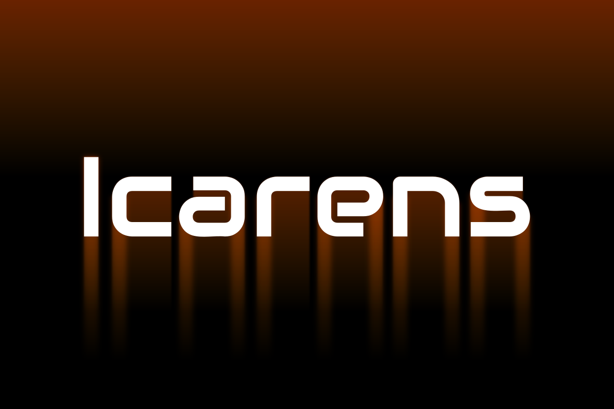
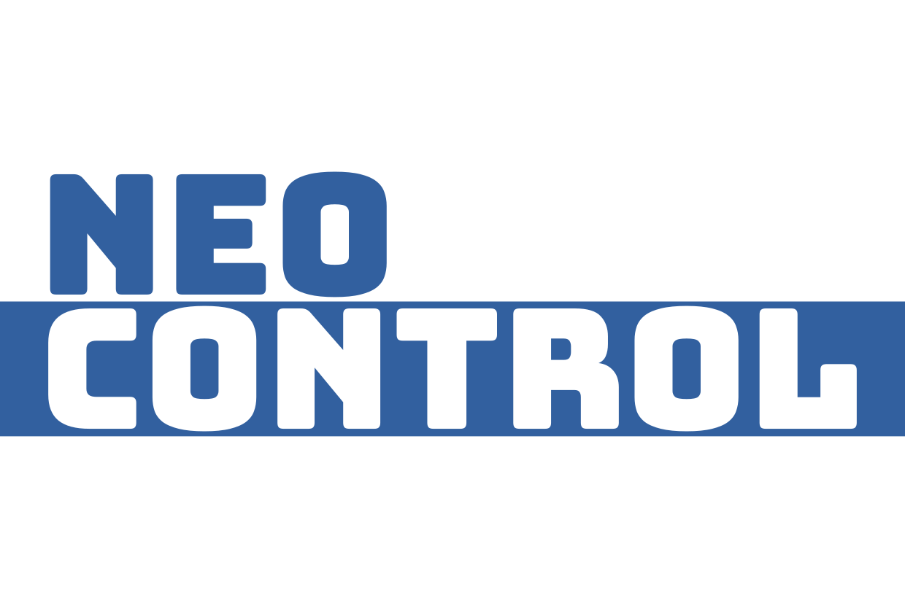
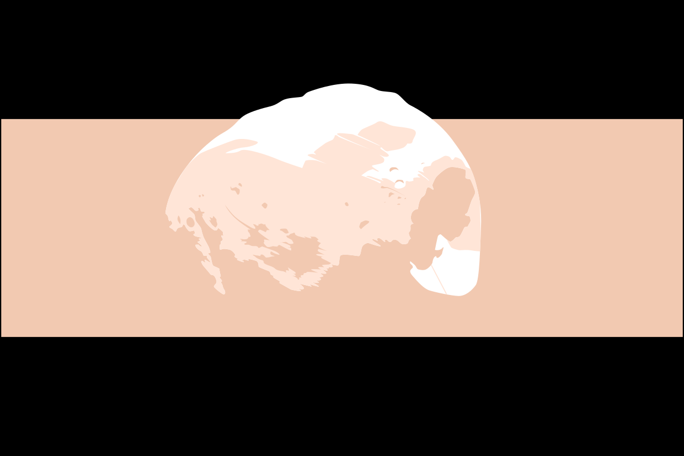
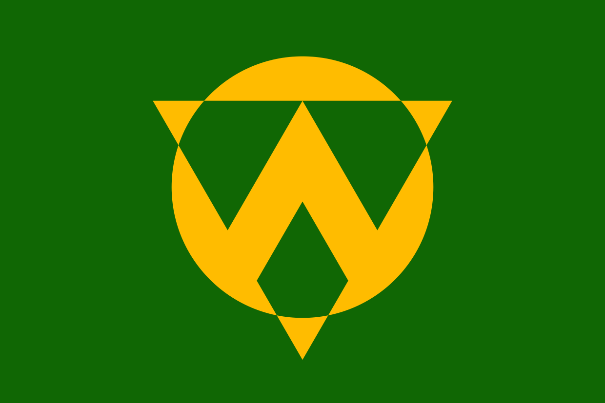
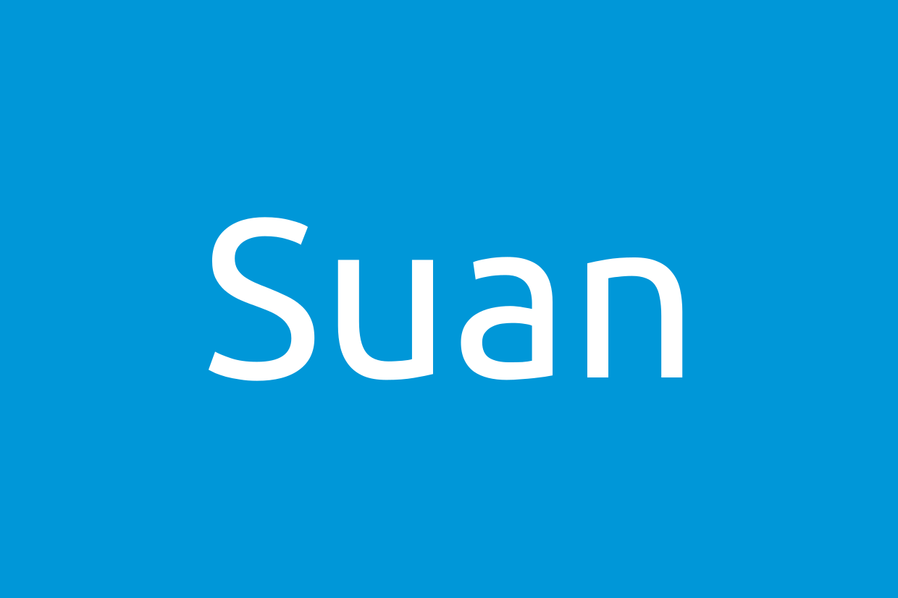
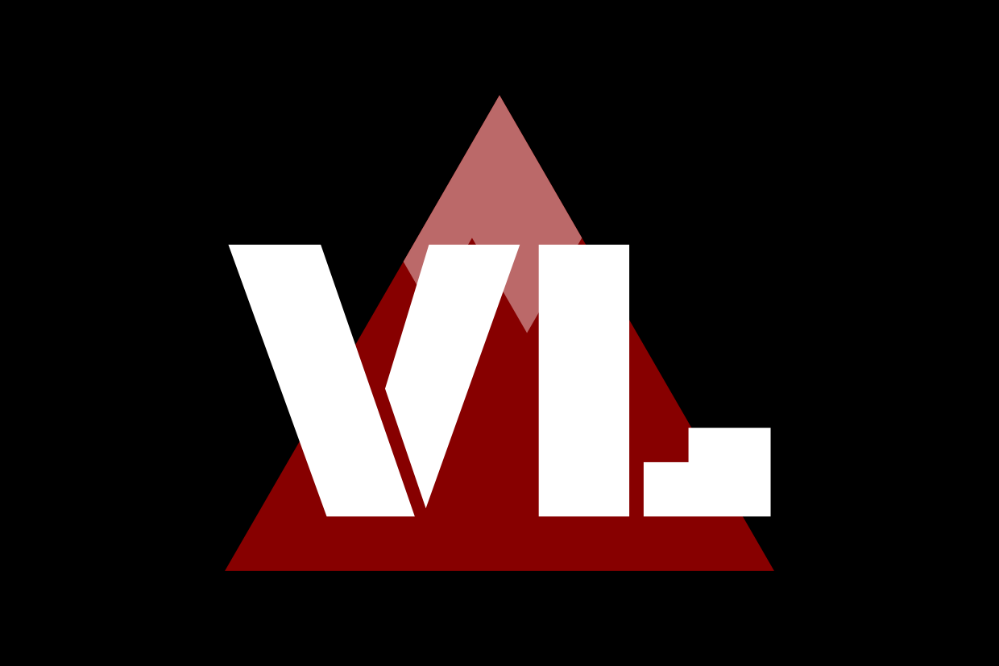
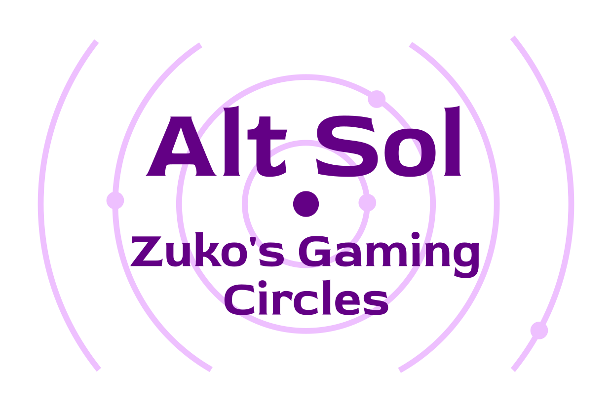
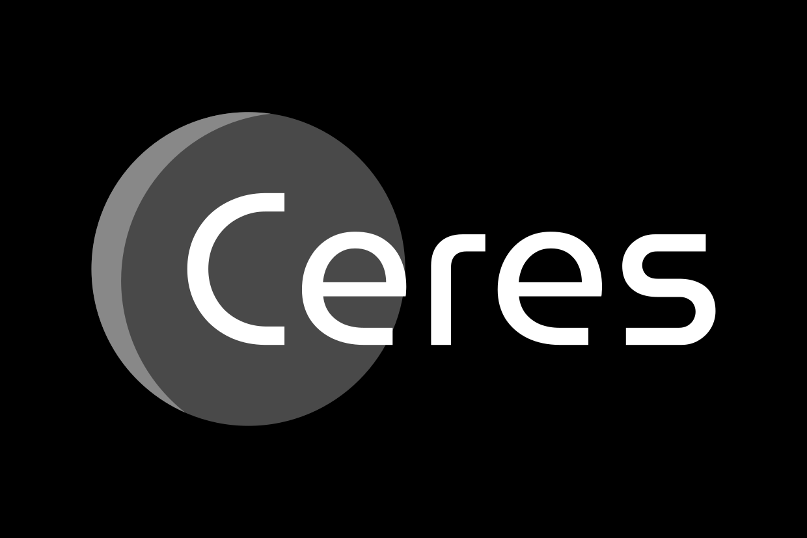
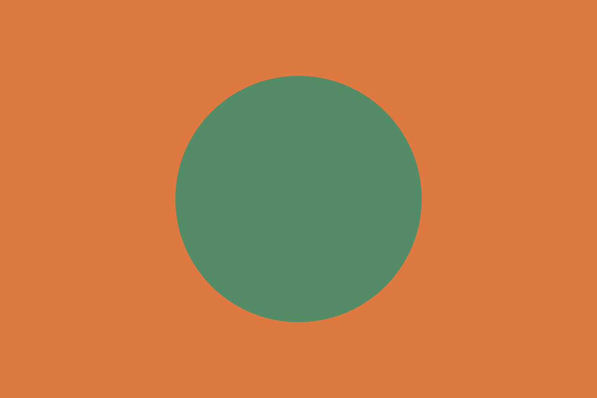

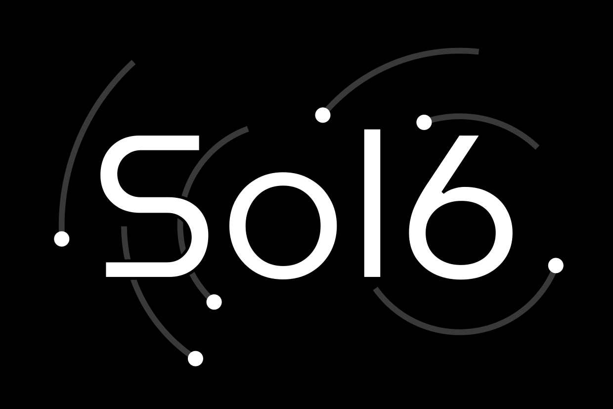
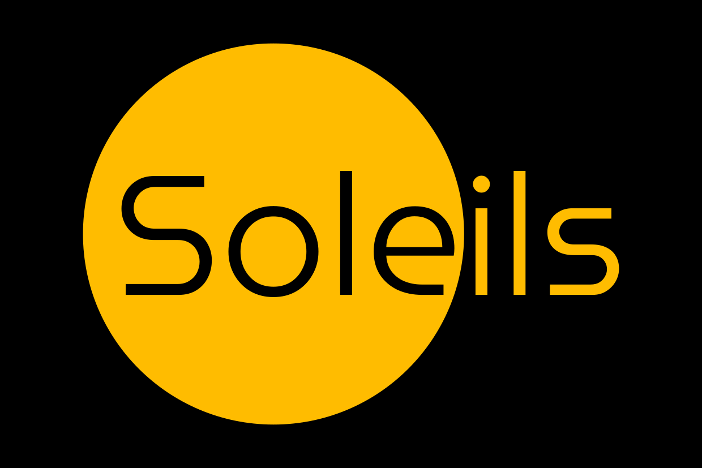

## Prochains travaux

Je continue le travail sur *Solaires* et j’ai commencé à retravailler le catalogue. Le but est de donner un peu plus de contexte sur ce quoi s’y trouve et de préciser l’accès ou le prix relatif de ce qu’on peut y trouver. Je pense aussi faire quelques illustrations pour les éléments les plus emblématiques du catalogue.

Dans le même temps, je vais aussi réintégrer les dernières règles du *Système Féerie* V5 dans le livre *Jouer à Solaires*.

## Les invisibles

Une petite note à propos de mon roman, *Les invisibles*. Si la relecture continue toujours officiellement, il me faut reconnaître qu’elle est en pause et je ne vois pas trop de moyen de la relancer. Le texte est toujours ouvert à la relecture et aux suggestions publiques sur [ce document](https://docs.google.com/document/d/1hTV0YVJPS7PlzAzBC2uy_k3q2F_L6uepsDACauFrjkY/edit?usp=sharing). Si vous voulez m’aider sur ce roman, ou si vous avez des conseils ou suggestion, c’est là que vous pourrez le faire.

Mais j’ai l’impression que je vais finir par le publier en l’état et passer à autre chose.

## Liens utiles

Général :
* Site de Solaires : https://solaires.feerie.net
* Discord : https://discord.gg/hWmsVkc
* Open Solars : https://opensolars.feerie.net
* SolNet : https://solnet.feerie.net
* Trello de Solaires : https://trello.com/b/VWHyMF6M

Textes et articles :
* Trello : https://trello.com/b/VWHyMF6M/solaires-textes-et-articles
* Sources : https://github.com/Greewi/SolairesSources
* Sources : https://github.com/Greewi/SystemeFeerieSources

SolNet :
* Application : https://solnet.feerie.net
* Trello : https://trello.com/b/xTp8Mobo/solaires-solnet
* Sources : https://github.com/Greewi/SolNet

Outils :
* Trello : https://trello.com/b/wnaY1rNs/solaires-outils
* Sources : https://github.com/Greewi/SolnetConverter