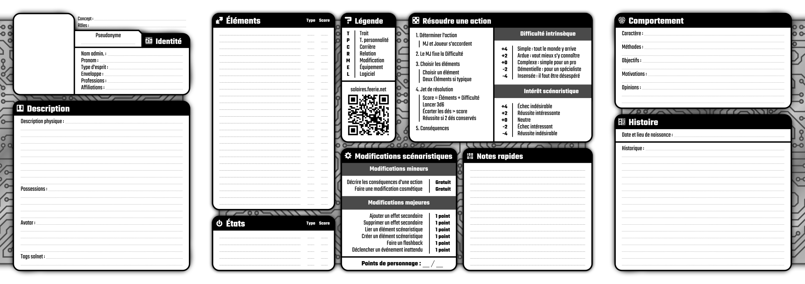

# Le point sur Solaires : 2020-09-05

Ces deux derniers mois ont été beaucoup plus laborieux que je ne l’aurais espéré. Concernant Solaires, j’ai essayé d’avancer sur la fiche de personnage et le catalogue. Mais avec la vague de chaleur, et un manque d’entrain certain, je n’ai pas vraiment avancé aussi loin que je l’aurais voulu.

## La fiche de personnage

Refaire une fiche de personnage devient critique, les règles sont pratiquement prêtes et avec le catalogue retravaillé, il ne me manque plus tant de choses à faire pour une première version bêta de la V6. Enfin, sauf une fiche de personnage, quelques pré-tirés et bien sur des scénarios réactualisés (mais sur ces derniers, je ne m’attends pas à beaucoup de changement).

Mais voila, faire une fiche de personnage est quelque chose de compliqué et ça l’est d’autant plus quand le système de jeu ne se prête pas aux formats conventionnels (faire une fiche avec des petites cases pour les caractéristiques et compétences marche bien, mais il faut avoir des caractéristiques et des compétences…). Pour le moment les rares retours que j’ai eu ne sont pas franchement positifs (j’irais jusqu’à dire qu’ils sont déprimants).

Je continue de tenter des choses, mais si ça ne mène nulle part, ce sera cette version bancale qui sera en ligne :

Une fiche est nécessaire et je ne vais pas bloquer le reste du jeu deux ans pour ça.

## Le catalogue

Mon travail de réorganisation/réécriture/complétion/correction du catalogue est terminé. Inévitablement, j’aurais des retours à traiter, mais il ne devrait pas y avoir de changement majeur dedans.

En plus d’avoir retravaillé la description de la plupart des éléments du catalogue, j’ai précisé systématiquement quelques informations importantes : comment on y accède, quelles restrictions légales s’appliquent et une échelle de prix. Pour ce dernier point, vous ne trouverez pas les prix en crédits, précis au centime mais ce que l’élément représente pour diverses entités (pour un particulier, une société ou une corporation). Je vous donne ici l’encart du chapeau du catalogue :

>> ### Note sur l’échelle des prix
>>
>> Les prix des appareils, logiciels et autres outils dans Solaires sont évalués selon une échelle non chiffrée. La comptabilité n’étant pas un enjeu, connaître les prix exacts des différents objets, outils et autres possessions n’est simplement pas utile. À la place, nous utiliserons une échelle simple qui indiquera ce que représente l’achat d’un produit donné pour une entité. Ainsi, une combinaison spatiale représentera un investissement important pour un particulier et sera négligeable pour une corporation.
>> * Gratuit : le produit n’a strictement aucun coût.
>> * Négligeable : le produit a un prix mais celui-ci est tellement faible qu’il n’est pas nécessaire de s’en préoccuper.
>> * Important : le produit représente un coût significatif mais ne demandera pas d’emprunt ou d’économie particulière.
>> * Stratégique : le produit possède un prix si élevé que l’entité doit disposer d’économies substantielles, de souscrire un prêt ou lui dédier un budget important.
>> * Inaccessible : le produit demande des ressources telles que l’entité est tout simplement incapable de s’en procurer un.

Vous trouverez les textes du catalogues sur GitHub : https://github.com/Greewi/SolairesSources/tree/master/Encyclop%C3%A9die/5%20-%20Le%20catalogue

## Les invisibles

Une avant-dernière note à propos du roman, *Les invisibles*. Mes correcteurs (un très grand merci à eux !) ont fait ce qu’ils pouvaient avec mes fautes et ma syntaxe douteuse. Je vais faire une dernière passe dessus dans le mois qui vient et le mettre en ligne.

Je ne suis probablement pas dans la meilleure période de ma vie, mais j’ai l’impression de me retrouver à nouveau dans la situation post NaNoWriMo 2014, où je me demandais si le jeu en valait la chandelle. Je ne suis pas sûr de participer à l’édition de cette année. Je mettrais probablement ce temps à contribution pour replacer les récits existants dans la chronologie de la V6… ou je le gâcherais comme j’en ai bien trop l’habitude. On verra.

## Prochains travaux

Je vais continuer le travail sur *Solaires*. En plus de mettre *Les invisibles* en ligne, je vais poursuivre mes expérimentations sur la fiche de personnage et réactualiser le livre *Jouer à Solaire*.

Ah, et si j’arrive à me motiver, pourquoi ne pas faire jouer un one-shot ou deux via discord.

## Bonus

Les rumeurs veulent qu’un certain JDW ait commencé à faire des trucs cool pour *Solaires* sur un logiciel tout aussi cool.

## Liens utiles

Général :
* Site de Solaires : https://solaires.feerie.net
* Discord : https://discord.gg/hWmsVkc
* Open Solars : https://opensolars.feerie.net
* SolNet : https://solnet.feerie.net
* Trello de Solaires : https://trello.com/b/VWHyMF6M

Textes et articles :
* Trello : https://trello.com/b/VWHyMF6M/solaires-textes-et-articles
* Sources : https://github.com/Greewi/SolairesSources
* Sources : https://github.com/Greewi/SystemeFeerieSources

SolNet :
* Application : https://solnet.feerie.net
* Trello : https://trello.com/b/xTp8Mobo/solaires-solnet
* Sources : https://github.com/Greewi/SolNet

Outils :
* Trello : https://trello.com/b/wnaY1rNs/solaires-outils
* Sources : https://github.com/Greewi/SolnetConverter