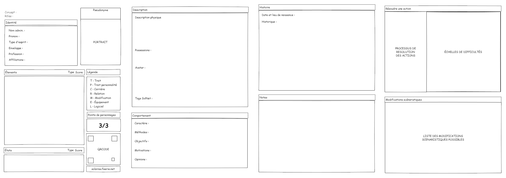
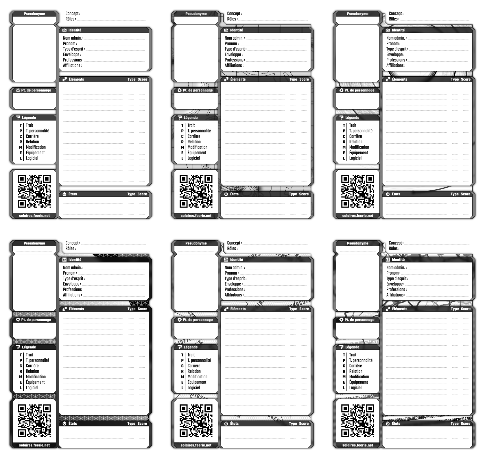
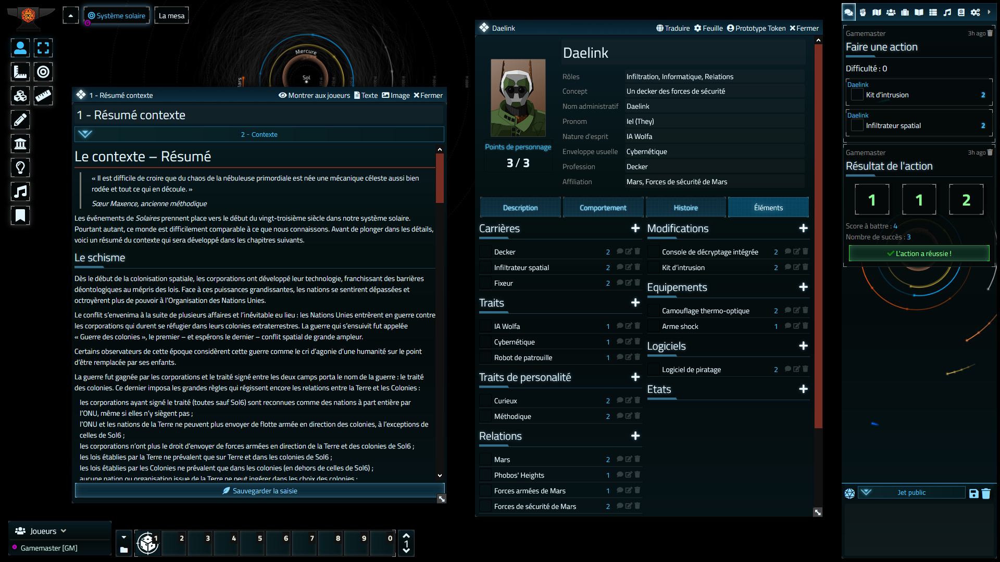

# Le point sur Solaires : 2021-03-13

Après plus de 4 mois de silence radio, voici quelques nouvelles de Solaires. Comme vous l’avez peut-être entendu ailleurs, j’ai déménagé début janvier et je suis encore dans les travaux. Je n’ai donc pas beaucoup avancé sur le sujet. Mais avant d’aller plus loin, bonne année à tous ! Eh oui, je n’avais même pas pris le temps de vous souhaiter mes meilleurs vœux !

Poursuivons ! Au programme : réunion, le Dragon de Callisto, travaux sur la fiche de personnage et… un module pour une table virtuelle ?

## La réunion de février

Sous une forme qui pourrait un peu faire penser à une assemblée générale d’association, j’ai organisé une petite réunion pour discuter de l’état et des prochains travaux début février. Pour plus de détails voici [mes notes de cette réunion](reunion%20-%202021-02-02.md).

Il est fort probable que j’organise d’autres réunions de type, car elle s’est avérée très intéressante.

## Le Dragon de Callisto

En novembre dernier, j’ai écrit un nouveau roman : Le Dragon de Callisto. Ce roman est le fruit de ma participation au NaNoWriMo 2020. Le premier jet peut être lu sur [Atramenta](https://www.atramenta.net/lire/solaires--le-dragon-de-callisto-nanowrimo-2020/83218).

Avec la situation sanitaire et le couvre feu, je n’ai plus trop l’occasion de prendre les transports pour aller au travail. Or c’était ces moments que j’utilisais pour lire et relire ce genre de travaux. Du coup, je n’ai pas encore pu mettre en ligne le document pour les relectures. J’ai bien commencé, mais on risque encore de devoir attendre un peu.

## La fiche de personnage

Le travail sur la fiche de personnage avance à un rythme assuré, ce qui est déjà quelque chose. On a déjà examiné plusieurs wireframes (des modèles sans aucun travail graphique pour travailler la disposition des éléments et l’organisation des informations) et nous nous sommes arrêtés sur deux présentations qui nous semblent prometteuses. L’une serait particulièrement adapté en convention/découverte et l’autre pour un usage plus régulier.

Voici à quoi ressemble le wireframe de la seconde version :

Fort de ce travail, je m’active sur le travail graphique et j’ai commencé en utilisant le wireframe de la première page de l’une des deux présentations. Pour le moment, si je suis globalement satisfait par le découpage et la forme de la page, le fond me pose quelques soucis, même si je sens que j’approche de quelque chose. Pour vos yeux, voici six versions : la première est simplement une version printer friendly.

## Un module Solaires pour FoundryVTT ?

Vous avez bien lu ! Grace au travail fantastique de JDW, Solaires a un module pour FoundryVTT sur les rails. Et il est même plus tôt bien avancé ! Comme vous pourrez le voir sur cette capture : ça s’annonce bien !

