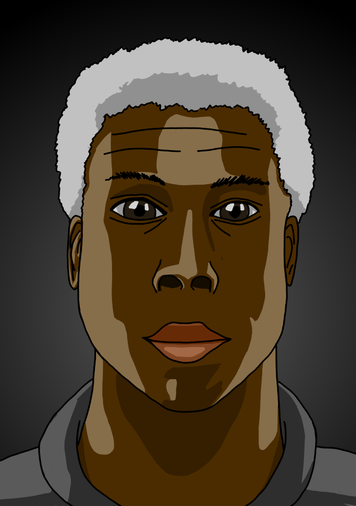
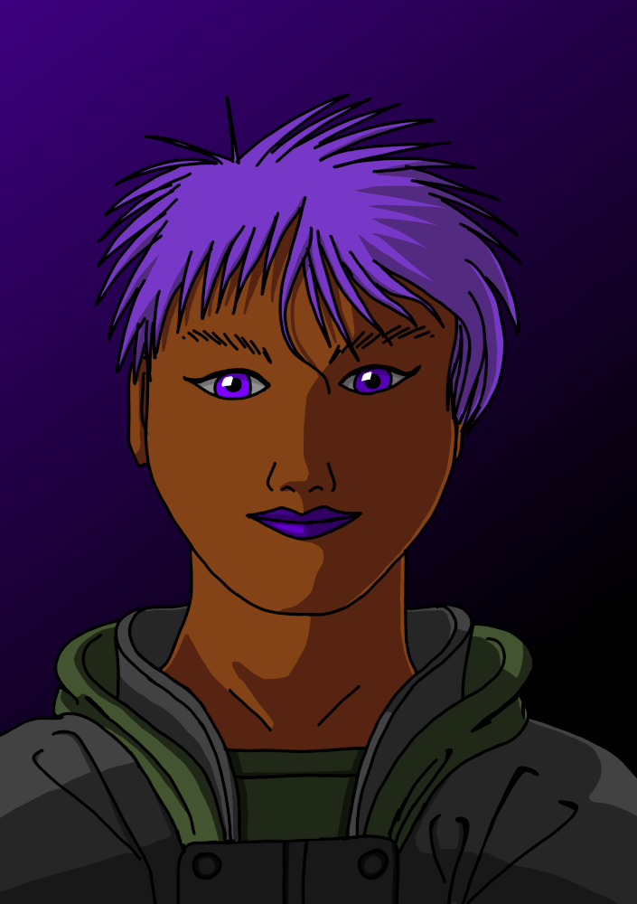
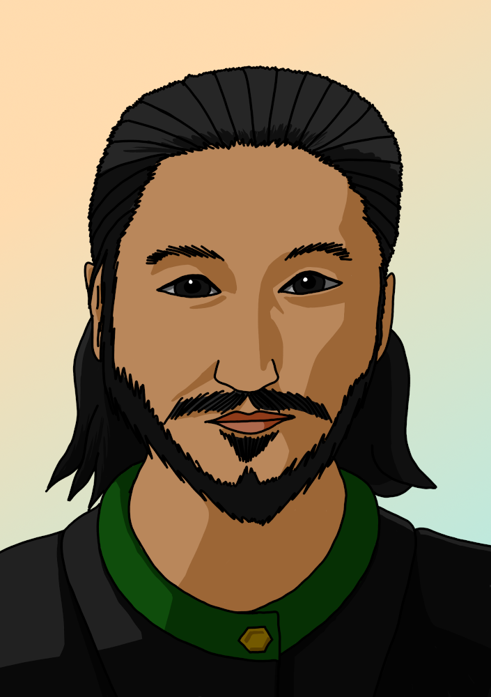
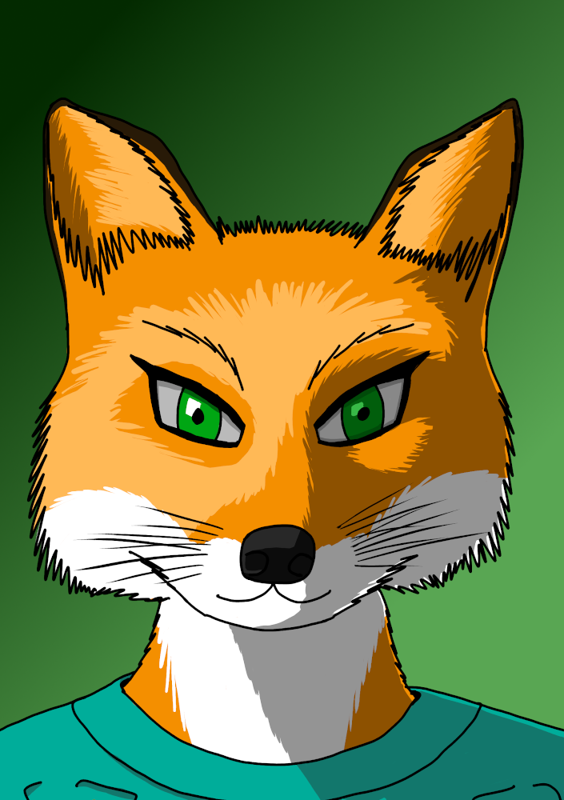
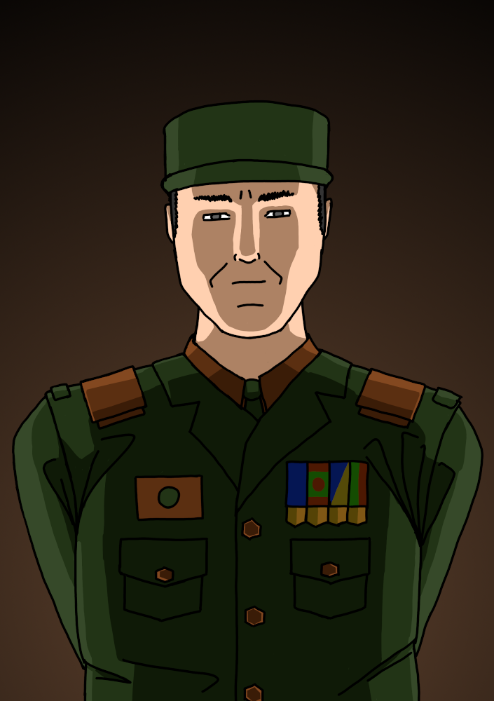
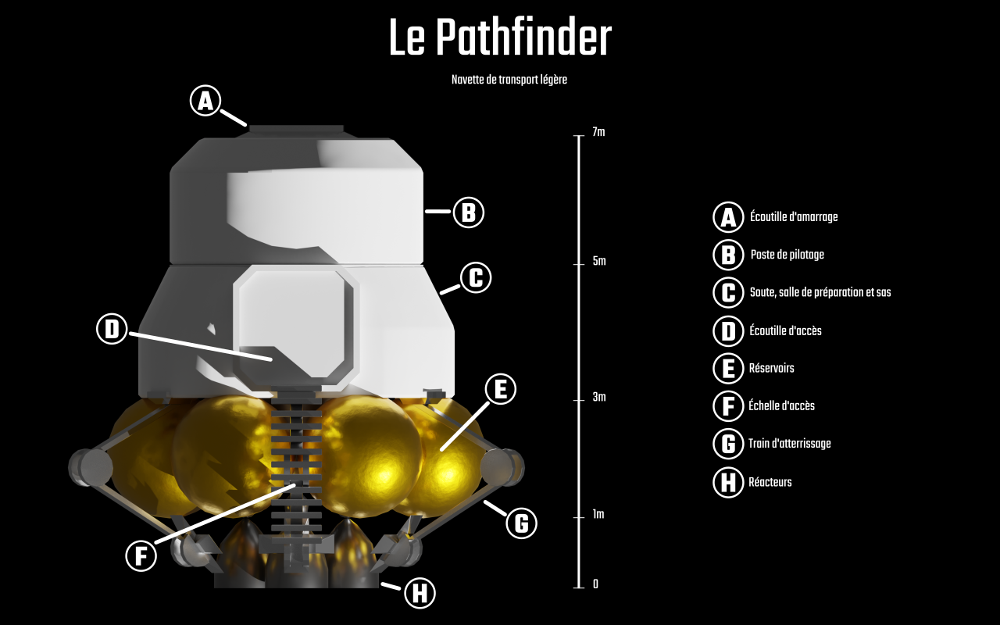

# Le point sur Féerie Network : 2021-05-13

Cela faisait deux mois que je n’avais pas donné de nouvelles de Solaires et du Système Féerie. Il est temps de rectifier le tir !

Au programme de ce billet, mise à jour de feerie.net, portraits de personnages de solaires, une mini-campagne en cours de test et un nouveau projet qui débute !

## Mise à jour de Féerie.net

Le site racine de feerie.net était resté sur l’ancien moteur qui utilisait docuwiki. En octobre dernier, j’avais remplacé ce moteur sur le site de Solaires et du Système Féerie. Désormais, le site racine est lui aussi passé sur ce nouveau moteur, plus compact et plus adapté à mes besoins (la partie wiki de l’ancien site n’a jamais vraiment été utile et les milliers de fichiers rendaient les sauvegardes beaucoup trop longue pour la quantité de contenu du site).

L’adresse n’a pas changé : [https://feerie.net](https://feerie.net). (Il est possible que vous ayez besoin de vider le cache de votre navigateur pour accéder au nouveau site).

De plus, comme cette série de billet de nouvelles concerne autant Solaires que le Système Féerie (et risque aussi de servir pour d’autres projets), les news ont été déplacées du site de Solaires vers le site racine.

## Portraits de personnages

Si les personnages de [l’équipe MSF-2](https://solaires.feerie.net/Encyclop%C3 %A9die/Personnages/%C3 %89quipe%20MSF-2) avaient déjà eu leur portrait, [le groupe d’indépendants](https://solaires.feerie.net/Encyclop%C3 %A9die/Personnages/Groupe%20d'ind%C3 %A9pendants) n’en avaient pas encore. Je me suis donc attelé à la tâche.

Olson, le récupérateur spatial :

Dash, la cyber-samouraï :

Tracer, le détective privé psion

Aury, la chimère technophile

En plus de ces personnages, j’ai aussi réalisé le portrait de l’Amiral Tovian, un PNJ récurrent, le principal donneur de mission de mars :

## La mini campagne Everrest

J’ai commencé à écrire et tester une nouvelle mini-campagne pour Solaires : Everrest. Celle-ci se déroule dans le système de Saturne et elle va emmener les personnages membres de l’équipage du Dijkstra à enquêter sur l’arrêt des communications d’une installation industrielle sur Mimas. Évidemment, j’ai réalisé quelques visuels pour l’occasion et voici le fameux vaisseau des PJ :

Pour cette campagne, j’ai fait d’autres visuels, mais ceux-ci pouvant gâcher la surprise, je ne les mettrais pas ici !

## Un nouveau projet ?

J’ai commencé à réfléchir à un autre projet utilisant le Système Féerie. Pour ceux qui me connaissent, ce ne sont pas les Contes de l’Entremondes que j’ai laissé en pause pour une durée indéterminée mais une nouvelle idée qui me travaille depuis plusieurs semaines déjà. Pour le moment, le nom temporaire de ce projet est La Troisième Terre. Il changera très certainement donc ne vous y attachez pas.

Voici un court pitch :

*La troisième Terre (Nom temporaire) est un jeu de science-fiction où vous jouerez des chimères anthropomorphes qui s’éveillent dans un monde étrange où l’humanité a disparu depuis bien longtemps.*

*Le monde est redevenu en grande partie sauvage et seuls quelques vestiges d’une civilisation avancée émergent encore. L’humanité n’est plus qu’une question archéologique et même ce qui leur a directement succédé n’est plus. Mais leur impact est toujours là et la technologie n’a pas disparu, et souvent pour le pire.*

*Avec un ton héroïque et très légèrement décalé, le jeu se focalise sur l’exploration, l’établissement de votre foyer, la résolution de problème et la survie dans un monde plutôt hostile.*

*Le jeu utilise le Système Féerie, adapté pour l’occasion avec notamment une création de personnage ultra courte et une progression des personnages un peu plus mécanique.*

Je me lance doucement dans ce projet pour quelques raisons simples :
* Ça me permet un peu de lever le pied sur Solaires, pour ceux qui ne me suivent pas vraiment, Solaires est un projet colossal que j’ai commencé en 2006 et pratiquement toute ma production sur mon temps personnel lui a été rattaché d’une façon ou d’une d’autre. Après… bientôt 15 ans, changer un peu d’air me fera du bien.
* J’ai envie de prendre au contre-pied certains aspects du Système Féerie tel que je l’ai utilisé dans Solaires. Par exemple, alors que dans Solaires la création des personnages demande de réfléchir de façon assez détaillée sur la description du personnage et de son histoire, la troisième Terre vous fait incarner un être qui vient tout juste de naître et tout en étant relativement standard.
* J’ai envie de pousser plus loin le concept des nevians (certains de mes contacts se souviennent peut-être d’une idée de jeu de société avec des nevians qui se déroulerait dans le futur très lointain de Solaires) à savoir des êtres artificiels qui se retrouvent « abandonnés » par leurs créateurs qui n’avaient pas vraiment réalisé ce qu’ils faisaient vraiment. Le tout avec un côté mignon, débrouille et aventure. Et je n’ai pas envie de transformer Solaires en un jeu Nevian où ces derniers sont déjà peut-être un peu trop présents.
* J’ai un peu envie d’explorer l’après humanité, un genre de post-apocalypse où l’humanité a vraiment disparu et où une poignée de successeurs, les PJ, se retrouvent à gérer ce qui reste après leur passage.

Bref, pour le moment le projet en est au tout début. J’ai commencé par la création de personnage pour voir ce que pourrait donner l’affaire. Si ça vous intéresse, vous trouverez ça [ici](https://github.com/Greewi/ProjectThirdEarth/blob/main/R%C3 %A8gles/Les%20personnages.md), mais c’est du temporaire de chez temporaire. J’essaie à la fois de trouver des choses qui donnent quelque chose d’intéressants mécaniquement mais aussi un style un peu décalé dans l’écriture.