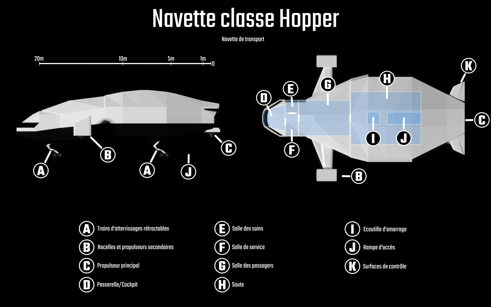

# Le point sur Féerie Network : 2021-06-14

Voici les dernières nouvelles concernant Solaires, le Système Féerie et les projets associés. Au programme : quelques avancées sur la mini-campagne *Everrest*, la relecture du *Dragon de Callisto* et quelques réflexions.

## La mini-campagne Everrest

La mini-campagne *Everrest* continue de progresser doucement et mon groupe de joueur a déjà accompli les deux premiers épisodes.

Pour le second épisode, j’ai réalisé quelques nouveaux visuels. Évidemment, je ne peux pas tous les montrer ici sous peine de gâcher la surprise pour ceux qui y joueraient (ce sont principalement des cartes ou des plans). Toutefois, voici un visuel pour un vaisseau spatial : la navette de transport de classe Hopper. En l’état, il ne me satisfait pas complètement et le retravaillerais sans doute encore plus tard. Notez que le Hopper est le modèle de vaisseau que Beka pilote dans mon dernier NaNoWriMo, *Le Dragon de Callisto*.

Le troisième épisode est encore en préparation (une préparation bien avancée ceci-dit). Là encore, quelques visuels sont en cours de création.

## Relecture du Dragon de Callisto

En parlant de Beka et du Hopper, j’ai fini un premier passage de relecture sur mon roman de novembre dernier, *Le Dragon de Callisto*. Quelques éléments du récit me gênent encore un peu et je vais probablement faire quelques ajustements sur l’histoire pour clarifier des incompréhensions qui m’ont été remontées. Quand ce sera fait, je ferais comme les années passées et mettrais le texte dans un google document pour vous permettre de m’aider sur la relecture finale.

Je ne pense pas participer cette année au NaNoWriMo, déjà parce que je sens que je n’en aurais pas encore fini avec le précédent d’ici là et ensuite parce que finalement, c’est vraiment beaucoup de travail pour un résultat qui me déçoit presque systématiquement.

Enfin, j’avais déjà dit ça l’année dernière…

## Un mot sur les autres projets

Et *La troisième Terre* ? Et le module *Foundry VTT* ? Et [*Féerie.net*](https://feerie.net) ? C’est assez simple : je n’ai pas vraiment avancé sur ces autres fronts.

Si la mini-campagne m’a permis d’avancer sur les tests du module Foundry, je n’ai pas fait plus que remonter quelques “issues” sur github. Par ailleurs, avec le projet de *La troisième Terre*, je me demande si un module plus générique pour le *Système Féerie* ne serait pas aussi pertinent. Après tout, le *Système Féerie* est mon système privilégié pour faire jouer des trucs comme *Star Wars*. J’ai des idées, mais leur réalisation est en dehors de mon horizon.