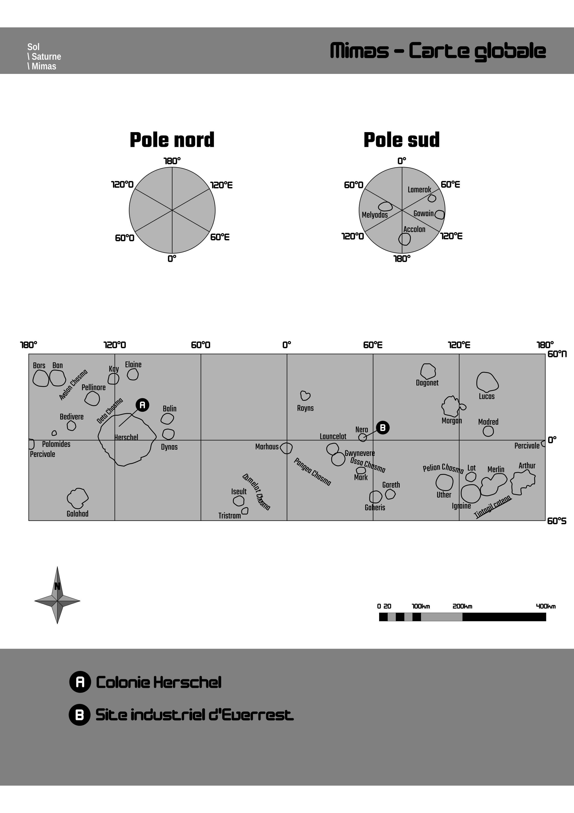
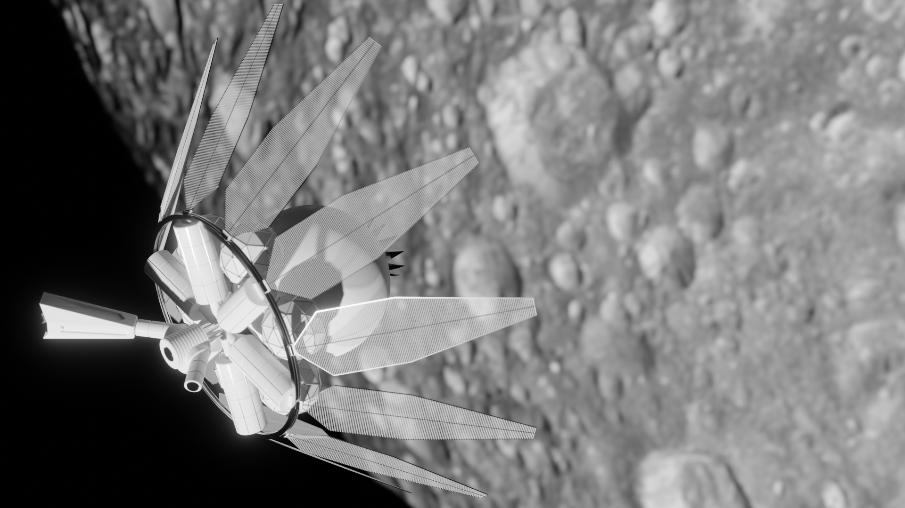

# Le point sur Féerie Network : 2021-08-10

Deux mois se sont écoulés depuis les dernières nouvelles sur *Solaires*, le *Système Féerie* et autres projets associés. C’est le moment de faire le point ! Au programme : publication du module *Solaires* pour *Foundry VTT*, fin du premier test de la mini-campagne *Everrest*, le *Dragon de Callisto* en relecture publique, et une timide progression sur le projet *Troisième Terre*.

## Solaires pour Foundry VTT

Grace à l’inestimable aide de JDW, *Solaires* possède désormais son système de jeu pour le logiciel de table virtuelle [Foundry VTT](https://foundryvtt.com/) que vous pourrez trouver ici : [https://foundryvtt.com/packages/solaires](https://foundryvtt.com/packages/solaires). Le module contient la fiche complète et le système de résolution des actions, mais aussi l’intégralité des textes des règles du jeu et de l’univers au travers des compendiums.

Lorsque la mini-campagne *Everrest* sera complètement rédigée, j’en ferais un monde directement utilisable dans ce système.

## Everrest

Mon premier groupe a terminé la mini-campagne *Everrest*. Les retours sont très positifs et j’ai déjà complété le scénario des petites trouvailles apparues au cours des parties. Pratiquement tous les visuels de jeu sont prêts. Voici quelques-uns de ces visuels (je ne vous mets évidemment pas ceux qui pourraient être source de divulgâchage) :

## Relecture du Dragon de Callisto

Le texte de mon NaNoWriMo 2020 est en relecture publique sur Google doc. Vous pourrez trouver le document [ici](https://docs.google.com/document/d/18X64QDd9Icjc26miygT57hJyfbL42jEJUx_w4Cn6QMU/edit?usp=sharing). Si vous voulez le lire, faire des retours ou proposer des corrections, n’hésitez pas ! (mais je veux votre nom/pseudo pour au moins vous créditer !)

## Projet Troisième Terre

Ces derniers mois, j’ai lu deux livres pour avancer le travail préparatoire sur ce projet de jeu qu’on pourrait qualifier de post-apocalyptique par son pitch.

Le premier, *The World Without Us* d’Alan Weisman (*Homo disparitus* dans la langue de RealMyop) est un essai très agréable à lire qui tente de décrire à quoi ressemblerait le monde si l’humanité disparaissait et quelles traces il resterait de nous. Il y a dedans quelques détails intéressants et ça remet en perspective la fragilité de tout ce qu’on a construit. Et vous ne sous-estimerez plus le pouvoir destructeur de l’eau.

Le second, *The Knowledge : How to Rebuild Our World After An Apocalypse* de Lewis Dartnell (*À ouvrir en cas d’apocalypse* dans la langue d’Antoine Daniel), se veut être le remède. C’est une lecture que je recommande beaucoup, non pas pour vraiment se préparer à une apocalypse (enfin, on sait jamais, mais ce livre ne vous aidera pas beaucoup les premiers mois), mais parce qu’il s’agit d’une plongée incroyable sur tout notre savoir et nos techniques accumulées au cours de l’histoire humaine, tant dans la métallurgie, la chimie, la manufacture, les sciences… Bref, c’est l’un de ces livres qui donnent le vertige et je l’ai aussi trouvé très plaisant à lire.

Concernant le projet en lui-même, même s’il correspond au genre post-apocalyptique, je ne souhaite pas l’orienter sur les aspects habituels du genre (comme les conflits de clans, les raiders et la mise en exergue d’un monde sans lois). Je vise vraiment de la science-fiction, avec une ambiance qui pourrait me rappeler *L’île Mystérieuse* de Jules Vernes (Un autre livre que j’ai beaucoup apprécié durant ma jeunesse). Bien sûr, des thèmes proches du transhumanisme (nos chères chimères auront l’occasion de changer), des conséquences de certaines technologies sur notre monde et, avouons-le, des IA seront de la partie.

Pour l’esthétique du tout, j’envisage un mélange de technologies primitives, d’appareils modernes et de technologie futuriste. Pour l’ambiance du jeu, j’aimerais quelque chose qui incite à l’exploration, la curiosité et l’expérimentation. J’aimerais un ton un peu plus léger que *Solaires* avec des chimères en mode système D et un peu d’humour noir (surtout pour ce qui concerne les traces de l’ancien monde).

Enfin, pour les mécaniques de jeu, même si je vais reprendre le *Système Féerie*, je veux clairement penser le jeu pour la campagne ouverte, où les participants peuvent venir et partir à leur guise (sans impliquer une mortalité anormalement élevée xD). La création de personnage que j’avais proposé dans le billet précédent (que vous pouvez lire [ici](https://github.com/Greewi/ProjectThirdEarth/blob/main/R%C3%A8gles/Les%20personnages.md)) est un bon début, mais il me reste encore pas mal de chose à voir, notamment pour permettre aux nouvelles chimères d’avoir leur utilité lors de leur première partie.

J’ai créé un salon sur le serveur Discord de Feerie.net. Si ça vous intéresse, [vous pouvez nous y retrouver](https://discord.gg/KyPTyesEak).

## Travaux futurs

Maintenant, que le système *Foundry VTT* pour *Solaires* est sorti, je pense m’atteler sur le module pour le Système Féerie. Après avoir finalisé et publier la campagne Everrest bien sûr. Je ne sais pas si je participerais au NaNoWriMo en novembre, mais j’ai commencé à regrouper quelques notes pour une histoire. Parce que oui, j’ai toujours des idées d’histoires qui me passent par la tête.

## Liens utiles

Général :
* Site : [https://feerie.net](https://feerie.net)
* Discord : [https://discord.gg/hWmsVkc](https://discord.gg/hWmsVkc)
