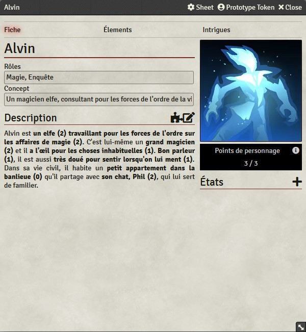

# Le point sur Féerie Network : 2021-12-10

Après des mois d’octobre et novembre chargés (avec l’Inktober et le NaNoWriMo), voici le retour du bulletin théoriquement hebdomadaire sur le *Système Féerie*, *Solaires*, le projet *Troisième Terre* et les autres projets associés. Au programme : quelques avancées sur le module *Système Féerie* pour *Foundry VTT*, poursuite des travaux sur le projet *Troisième Terre*, quelques mots sur la mini campagne *Everrest* et le nouveau roman.

## Un module Système Féerie pour Foundry VTT

Comme je vous en parlais dans le précédent bulletin, j’ai commencé à travailler sur un module pour le *Système Féerie*. Ces travaux ont suffisamment avancé pour pouvoir permettre son utilisation et une partie de test est déjà planifiée (ce sera mon scénario *Nuke'em all* des *Contes de l’Entremondes*).

Au niveau des fonctionnalités implémentées :
* Création des personnages basés sur la description
* Extraction des éléments par sélection
* Système de résolution identique au module pour *Solaires*
* Système de progression identique au module pour *Solaires*
* Catégories d’éléments personnalisable
* Aide de jeu intégrée à la fiche pour les modifications scénaristiques

Le module peut être trouvé sur GitHub à cette adresse : [https://github.com/Greewi/SystemeFeerie-FoundryVTT](https://github.com/Greewi/SystemeFeerie-FoundryVTT) ;

>> Le Système Féerie est un système de jeu de rôle adaptable qui met l’accent sur la description et le sens. Expurgé des règles traditionnelles issues des wargames, il préfère reposer sur ce qui se passe dans l’histoire plutôt que sur des mécaniques abstraites. Ainsi les personnages sont construits à partir de leur description et le résultat effectif des actions est laissé à la discrétion des participants.

## Projet Troisième Terre

Concernant le projet *Troisième Terre*, les travaux et réflexions se poursuivent en se concentrant sur le contenu des parties. J’ai commencé à construire les éléments des péripéties et des complications pour avoir une idée plus claire de ce à quoi les chimères auront affaire durant leurs aventures. À ces pistes s’ajoutent le début d’un “bestiaire” qui regroupera la faune et les autres choses qui habitent les jungles de l’île où se trouvent les créatures et des éclaircissements sur les secrets de l’univers.

Maintenant, il va sérieusement falloir que je place tous ces éléments sur une carte, que je réfléchisse consciencieusement à la progression technologique des chimères au fil des aventures (en leur donnant les clés de l’univers dans un ordre approprié).

Mais surtout : il est temps d’essayer le jeu. Je compte lancer une mini campagne prototype courant janvier pour tester ces idées et voir ce qui marche ou non. Ce projet présente quelques défis dont le format en campagne qui rend les tests sur des one-shots insuffisants. Ne vous méprenez pas : les parties individuelles restent importantes, mais si je veux restituer le vertige de l’évolution technologie, la métamorphose du transhumanisme et la construction de la communauté des chimères, il me faut aussi tester le format de la campagne.

Si tout ceci vous intéresse, j’ai créé un salon sur le serveur Discord de Feerie.net et [vous pouvez nous y retrouver](https://discord.gg/KyPTyesEak).

>> Dans *Troisième Terre* (nom temporaire) vous incarnez une chimère, un être biomécanique tout mignon qui a été conçu pour servir de nourrice, mascotte, assistant domestique, etc. Mais voila, alors qu’elle s’éveille, elle se rend compte que sa capsule de livraison a échoué dans une jungle épaisse et que l’humanité n’est plus qu’un élément du passé.

## Everrest

La mini campagne *Everrest* pour *Solaires* voit son troisième groupe de joueur mener l’enquête sur les événements troubles de cette affaire. Ce n’est plus vraiment une partie de test, les deux précédentes itérations ont déjà bien dégagé le terrain. Si tout va bien, je devrais pouvoir publier la campagne sur le site de *Solaires* au premier trimestre 2022.

Il me manque toutefois quelques illustrations pour certains des PNJ. Si je trouve la motivation, je pourrais peut-être vous les présenter lors du prochain bulletin.

## Inktober et NaNoWriMo

Curieusement, aucune de mes participations à ces deux événements créatifs n’est vraiment lié aux projets de *Féerie network*. À la limite la dernière illustration de l’Inktober pourrait entrer dans l’univers du projet *Troisième terre*, mais ça reste très limité.

L’Inktober, qui se déroule en octobre, est un défi d’illustration à l’encre où à chaque jour est attribué un thème. Il s’agit de ma première participation et si je ne suis pas vraiment illustrateur, j’ai pu essayer, avec des hauts et des bas, quelques trucs. Vous trouverez mes gribouillis sur [ArtStation](https://www.artstation.com/artwork/G8Og9d).

Le NaNoWriMo, lui se déroule en novembre. C’est un défi littéraire où il faut écrire un roman d’au moins cinquante-mille mots en trente jours. Il s’agit là de ma sixième participation (la cinquième de suite) et si les précédentes éditions j’avais écrit pour *Solaires*, ce n’est pas le cas cette année. *Eka*, mon roman de 2021 est un roman de science que vous pouvez lire sur [Atramenta](https://www.atramenta.net/lire/eka-nanowrimo2021/87083) et sur [Google Doc](https://docs.google.com/document/d/1TTOsVl3x7FAydfqYyN_SI7cxs-2pBtYKKWDwxmkCcGw/edit?usp=sharing) (qui est le meilleur endroit pour me suggérer des corrections ou poser des questions).

>> Eka : Dans le tristement célèbre district dix-sept d’une dictature, un lycéen se découvre des facultés étranges et déclenche une série d’événements qui va rapidement le dépasser. Au même moment deux justiciers enquêtent sur un signal étrange qui attirera des êtres venus de plus loin encore.

En parlant de NaNoWriMo, ce que je craignais l’année dernière vient de se réaliser : j’ai désormais écrit un roman alors que les relectures du précédent ne sont pas encore terminées. C’est une situation qui m’avait beaucoup fait hésiter cette année. Si vous souhaitez lire ou aider à la relecture, vous trouverez le texte de *Le dragon de Callisto* sur [Google Doc](https://docs.google.com/document/d/18X64QDd9Icjc26miygT57hJyfbL42jEJUx_w4Cn6QMU/edit?usp=sharing). Pour le coup, celui-ci se déroule bien dans l’univers de *Solaires*.

>> Le dragon de Callisto : Alors qu’une pilote martienne se retrouve embarquée à contrecœur dans un inquiétant complot, une enquêtrice du plus prestigieux corps d’investigation s’attaque à une nouvelle affaire. Privées d’autre adversaire, les puissantes colonies des solaires vont devoir faire face à un ennemi venu de l’intérieur.

Ah, là aussi, il faut encore que je ressorte les crayons (numériques) car aucune de ces deux œuvres n’a de couverture pour le moment.

## Travaux futurs

Comme annoncé dans les sections précédentes, mes prochains efforts vont surtout concerner le projet *Troisième Terre*, en particulier l’organisation de la campagne prototype. En l’absence de problème lors des tests sur le module *Foundry VTT* pour le *Système Féerie*, je publierais aussi celui-ci. Pour ce qui est de la relecture du roman *Eka*, je m’y remettrais vraisemblablement au début de l’année prochaine.

Enfin, je commence à accumuler des illustrations en souffrances, que ce soit pour l’inspiration pour le projet avec les chimères perdues dans la jungle, la campagne *Everrest* ou les deux romans de 2020 et 2021.

Bref, des tas de choses à faire !

## Liens utiles

Général :
* Site : [https://feerie.net](https://feerie.net)
* Discord : [https://discord.gg/zG9Qxmdm5C](https://discord.gg/zG9Qxmdm5C)