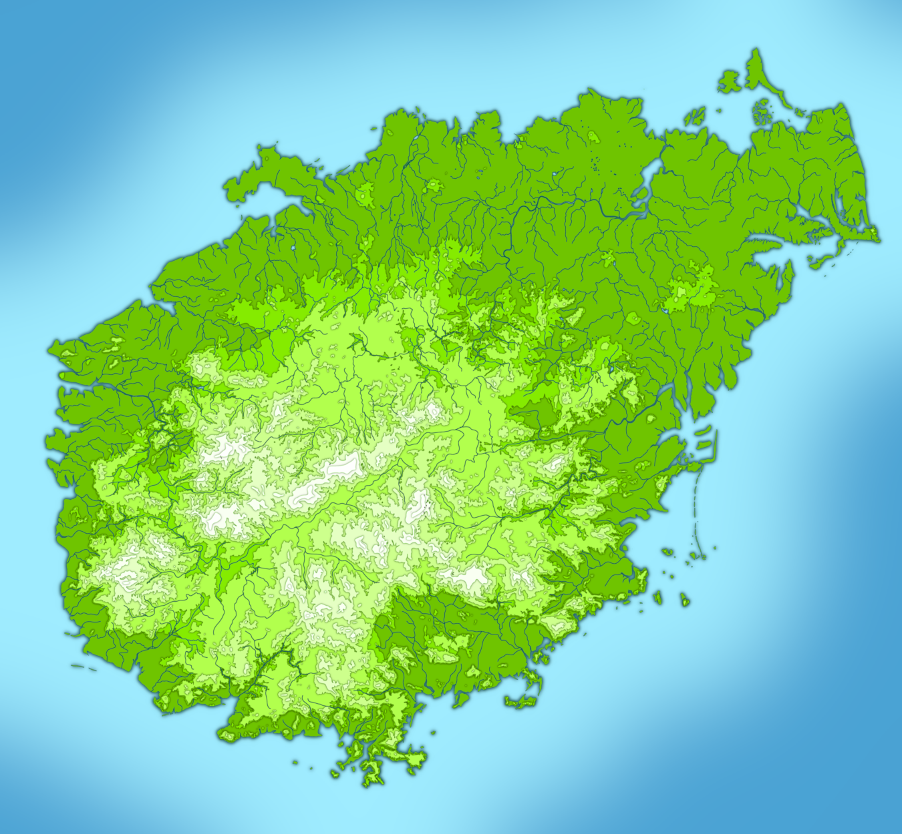

# Le point sur Féerie Network : 2022-01-07

Avant toute chose : bonne année et bonne santé ! Bon, pour ce second point la situation semble quand même toujours aussi mal barrée, mais je vous souhaite la moins pire possible.

Quoi de neuf en ce début 2022 pour le *Système Féerie*, *Solaires*, le projet *Troisième Terre* et les autres projets associés ? Au programme : la sortie du module FoundryVTT pour le *Système Féerie*, la mise à jour du module pour *Solaires* et le début de travail sur une carte pour le projet *Troisième Terre*.

## Mise en ligne du module FoundryVTT pour Système Féerie

Le module pour le *Système Féerie* est enfin terminé et la partie test s’est bien déroulé avec seulement quelques rares bugs mineurs qui ont été corrigés depuis ! Vous pouvez obtenir la première version sur [GitHub](https://github.com/Greewi/SystemeFeerie-FoundryVTT), sur le site de [FoundryVTT](https://foundryvtt.com/packages/sysfeerie) ainsi que dans la recherche des systèmes dans FoundryVTT même.

Vous trouverez plus d’informations sur les liens précédents.

>> Le Système Féerie est un système de jeu de rôle adaptable qui met l’accent sur la description et le sens. Expurgé des règles traditionnelles issues des wargames, il préfère reposer sur ce qui se passe dans l’histoire plutôt que sur des mécaniques abstraites. Ainsi les personnages sont construits à partir de leur description et le résultat effectif des actions est laissé à la discrétion des participants.

## Mise à jour du module FoundryVTT pour Solaires

*FoundryVTT* est passé récemment en version 9 et qui dit nouvelle version majeure, dit incompatibilités diverses. J’ai donc fait un passage sur le module pour *Solaires* et corrigé tous les bugs qui sont apparus avec cette nouvelle version. Si vous utilisez ce module, vous pouvez le mettre à jour dès maintenant dans l’interface de *FoundryVTT*.

>> Solaires est un jeu de rôle de science-fiction qui place les joueurs dans la peau d’enfant de l’humanité qui vivant des aventures dans le système solaire vers le début du XXIIIe siècle. Il explore les thèmes du transhumanisme, de la colonisation spatiale, de la technologie, de l’héroïsme et, dans une moindre mesure, le paradoxe de Fermi.

## La carte de l’île pour le projet Troisième Terre

Pour le projet *Troisième Terre*, j’ai commencé à travailler sur une carte de la région où se passeront les aventures de nos chimères. Je me base sur une île existante en tentant de lui apporter les changements qui reflètent la disparition de l’humanité et le temps qui s’est écoulé depuis.

Voici un aperçu de ces travaux (pour des raisons de divulgâchage, il est très probable que les prochaines versions de cette carte qui contiendront plus d’informations sensibles, ne soient pas partagées publiquement) :

Si tout ceci vous intéresse, j’ai créé un salon sur le serveur Discord de Feerie.net et [vous pouvez nous y retrouver](https://discord.gg/KyPTyesEak). Je compte d’ailleurs lancer une partie prototype sous un format de mini campagne pour tester mes idées dans le mois.

>> Dans *Troisième Terre* (nom temporaire) vous incarnez une chimère, un être biomécanique tout mignon qui a été conçu pour servir de nourrice, mascotte, assistant domestique, etc. Mais voila, alors qu’elle s’éveille, elle se rend compte que sa capsule de livraison a échoué dans une jungle épaisse et que l’humanité n’est plus qu’un élément du passé.

## Relectures en cours

Si relire des textes vous intéresse, mon roman issu du NaNoWriMo 2021, *Eka* est toujours en relecture préliminaire sur [Google Doc](https://docs.google.com/document/d/1TTOsVl3x7FAydfqYyN_SI7cxs-2pBtYKKWDwxmkCcGw/edit?usp=sharing).

>> Eka : Dans le tristement célèbre district dix-sept d’une dictature, un lycéen se découvre des facultés étranges et déclenche une série d’événements qui va rapidement le dépasser. Au même moment, deux justiciers enquêtent sur un signal étrange qui attirera des êtres venus de plus loin encore.

Celui de l’année d’avant, *Le dragon de Callisto*, est toujours lui en relecture (et ça fera un an dans quelques semaines). Vous trouverez le texte sur [Google Doc](https://docs.google.com/document/d/18X64QDd9Icjc26miygT57hJyfbL42jEJUx_w4Cn6QMU/edit?usp=sharing).

>> Le dragon de Callisto : Alors qu’une pilote martienne se retrouve embarquée à contrecœur dans un inquiétant complot, une enquêtrice du plus prestigieux corps d’investigation s’attaque à une nouvelle affaire. Privées d’autre adversaire, les puissantes colonies des solaires vont devoir faire face à un ennemi venu de l’intérieur.

## Travaux futurs

Mes travaux pour ce mois vont se concentrer sur le projet *Troisième Terre* : je souhaite lancer la mini campagne prototype d’ici la fin du mois et il me reste encore des éléments à aplanir, en particulier l’arbre technologie, certains éléments de progression et bien sûr le fragment de la carte qui sera utilisé.

Avec la situation sanitaire de ce début d’année, je suis en télétravail et ne pourrait donc probablement pas faire ma part de la relecture de *Eka*, car je profitais surtout des trajets pour le faire.

Le reste (pas mal d’illustrations, quelques couvertures, la mise en forme de la campagne Everrest) attendra malheureusement encore un peu. Je ne manque pas de choses à faire !
## Liens utiles

Général :
* Site : [https://feerie.net](https://feerie.net)
* Discord : [https://discord.gg/zG9Qxmdm5C](https://discord.gg/zG9Qxmdm5C)
