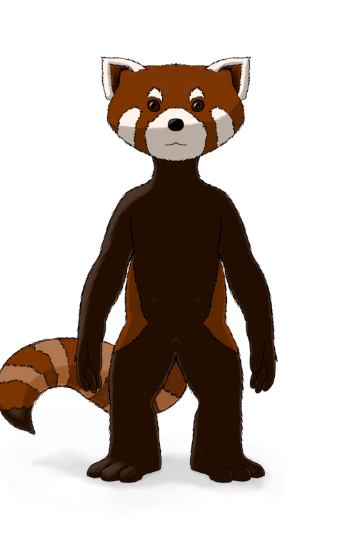

# Le point sur Féerie Network : 2022-10-03

Après sept mois de silence, revoici le billet traitant des nouvelles autour des projets de Féerie.net, le système Féerie, Solaire et le projet 3e Terre. Sept mois, l’ironie voulait à l’origine que ce soit un billet hebdomadaire. Mais ce délai traduit malheureusement le ralentissement général autour de mes projets.

Ce billet sera donc plutôt court. Au programme, des avancées sur le système de jeu pour le projet 3e Terre, un prototype de création de personnage et même une illustration.

## Projet 3e Terre

Le projet 3e Terre avance doucement. Bien plus doucement que je ne l’aurais aimé, mais je peine à trouver la motivation pour avancer significativement dessus. Malgré tout, j’ai écrit une première version du système de résolution et celui-ci a pu être testé lors d’une partie (merci à mes quatre cobayes). Le système fonctionne bien et fait bien ce que je souhaite qu’il fasse. Vous pouvez trouver ces textes sur le [dépôt github du projet](https://github.com/Greewi/ProjectThirdEarth/tree/main/v0.2.0).

Et en parlant de ça, j’ai profité de cette expérience pour écrire un [petit article](https://feerie.net/articles/pourquoi%20un%20systeme%20de%20jeu) qui détaille une étape importante de la conception d’un système : déterminer ce qu’on veut qu’il fasse. J’y présente aussi les choix que j’ai initialement faits pour le projet 3e Terre.

J’ai aussi travaillé sur un prototype pour la création de personnage que vous trouverez sur [ce site](https://dao.feerie.net/). L’idée est de donner une existence diégétique aux choix effectués durant cette création de personnage.

Bonus, j’ai aussi fait quelques recherches pour trouver une apparence aux petites créatures à fourrures que vous incarnerez :

## Et ensuite ?

Pour les semaines/mois à venir (en fonction de ma motivation), je compte avancer sur les règles des entreséances (il y a déjà un premier jet de certains aspects sur le dépôt) en particulier tout l’arbre technologique du niveau primitif.

Quand ce sera fait, il me faudra juste créer le matériel nécessaire pour lancer une mini-campagne de test. Allez, soyons optimistes et visons 2023 ?

## Liens utiles

Général :
* Site : [https://feerie.net](https://feerie.net)
* Discord : [https://discord.gg/zG9Qxmdm5C](https://discord.gg/zG9Qxmdm5C)